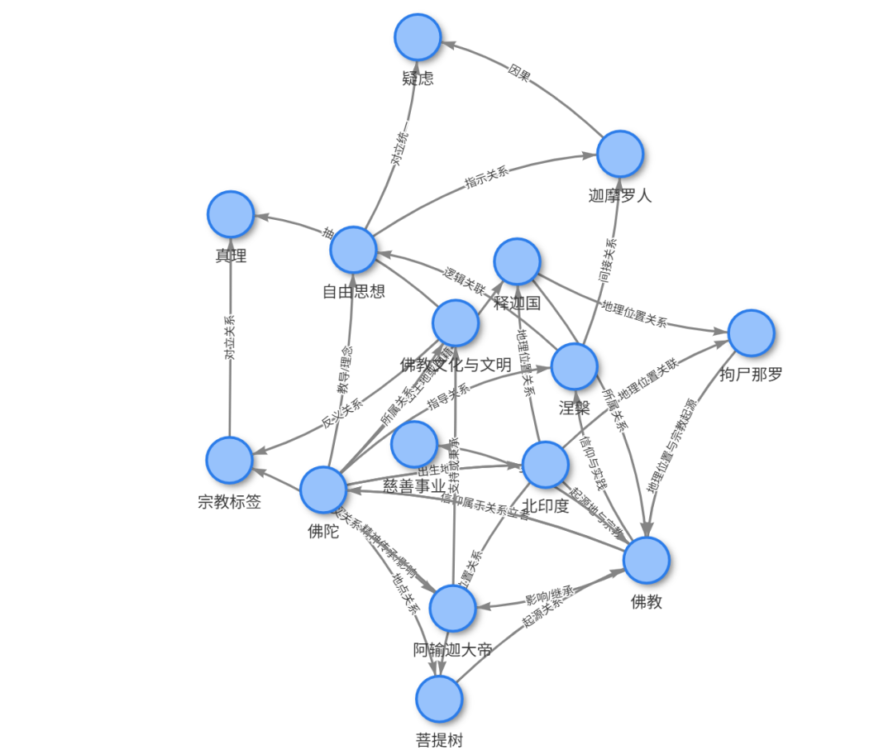
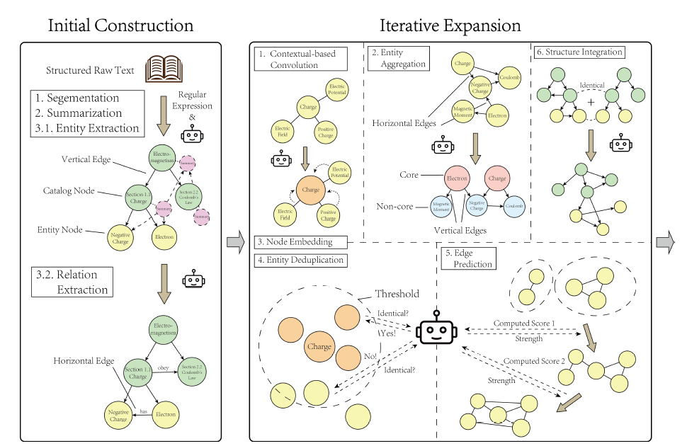
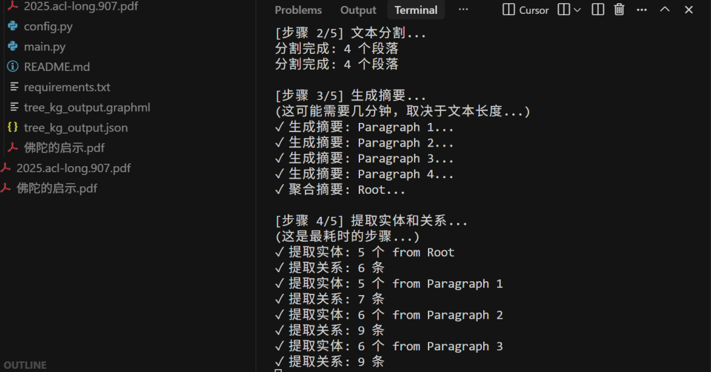
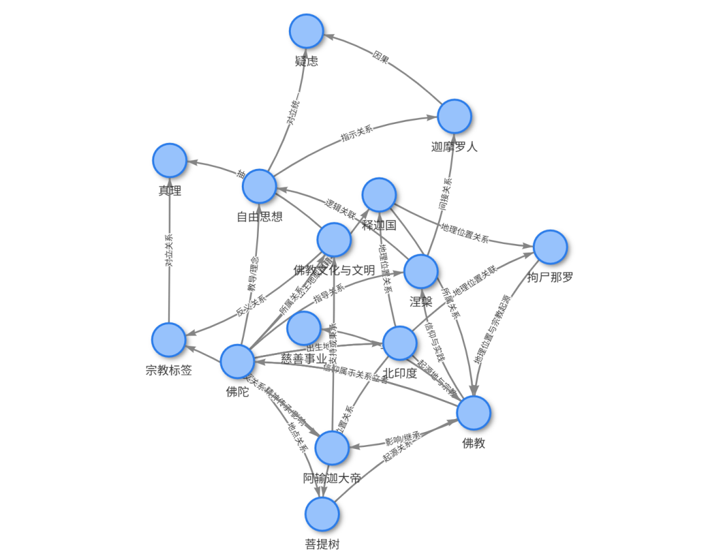

# Tree-KG微信公众号文章：清华大学Tree-KG框架解析

来源：https://mp.weixin.qq.com/s/TnaYmO5i7kMK6O3bs1KjLw?scene=1&click_id=774939261

抓取时间：2026-06-22T11:16:36

---

#

# 最近，清华大学团队在ACL会议上发布了Tree-KG框架，这是一个专门为知识密集型领域设计的可扩展知识图谱构建方案。其核心创新在于将教科书的层次化结构与大语言模型的语义理解能力相结合。

Tree-KG要解决的核心问题是：如何在科研、医疗、法律等知识密集型领域，快速构建高质量且可持续扩展的知识图谱？传统方法面临三大困境——知识复杂度高、人工标注成本巨大、知识更新速度快。实验数据显示，Tree-KG在多个数据集上的F1分数比第二名高出12-16%，在Text-Annotated数据集上达到0.81的F1分数，同时token使用量降低约40%。

本文将基于公开发表的论文，深度解析Tree-KG的技术架构、核心算法，并用一个实例测试论文方法，见文章开始图片，希望对你有所启发。

## PART 01 技术背景：知识图谱构建的三大范式演进

### 1.1 传统方法的局限性

知识图谱（Knowledge Graph）是一种结构化的知识表示方法，通过实体、关系和上下文依赖来组织领域知识。在知识密集型领域，知识图谱的构建面临独特挑战。

规则基方法的困境

早期的YAGO系统通过预定义的逻辑规则进行知识抽取，虽然精度高，但存在三大问题：

可扩展性差：每个新领域都需要重新编写规则

泛化能力弱：规则难以覆盖知识的多样性

脆弱性高：小的格式变化就会导致规则失效

监督学习的瓶颈

TextRunner等基于CRF的序列标注模型依赖大规模标注数据，面临：

标注成本高：专业领域需要领域专家参与标注

数据依赖性强：泛化到新领域需要重新训练

适应性有限：知识更新需要重新标注和训练

大模型方法的盲点

当前基于LLM的知识图谱构建方法虽然灵活，但缺乏：

明确的知识结构：生成的图谱缺乏层次性

语义一致性：不同批次生成的结果可能矛盾

增量机制：难以高效地更新和扩展

### 1.2 人类认知启发的设计理念

Tree-KG的设计灵感来源于人类组织知识的方式——教科书的层次化结构。研究团队对物理教科书进行了实证分析，将教科书分为129个章节，提取约1000个实体，随机采样5000个实体对，使用LLM评估其关系强度（0-10分）。

三个关键发现：

结构可利用性：教科书的章节结构天然反映了知识的组织逻辑

局部强关联：同一章节内的实体连接强度最高（平均8.5分）

上下文重要性：相邻章节的实体仍有显著关系（平均6.2分）

这些发现验证了一个假设：教科书的树状结构可以作为知识图谱构建的骨架。

### 1.3 显式KG与隐式KG的双层架构

Tree-KG创新性地提出了双层知识图谱架构：

显式KG（Explicit KG）

基于教科书的目录结构构建

章节作为节点，层级关系作为边

每个章节包含摘要和核心实体

提供清晰的知识组织骨架

隐式KG（Hidden KG）

通过迭代扩展发现潜在关系

利用语义相似度和上下文关联

揭示跨章节的知识连接

丰富图谱的横向关系

这种双层架构既保证了知识的结构化组织，又能发现深层的知识关联。

## PART 02 核心架构

### 2.1 两阶段构建流程

Tree-KG的应用架构分为两个核心阶段：

│ 阶段一：显式KG构建 ││ ┌──────────────────────────────────────┐ ││ │ 1. 文本分割（按章节结构） │ ││ │ 2. LLM摘要生成（每个章节） │ ││ │ 3. 实体抽取（基于摘要） │ ││ │ 4. 树状结构构建（垂直边） │ ││ └──────────────────────────────────────┘ │└─────────────────────────────────────────────┘↓┌─────────────────────────────────────────────┐│ 阶段二：隐式KG扩展 ││ ┌──────────────────────────────────────┐ ││ │ 迭代执行以下操作： │ ││ │ 1. Conv（卷积）: 增强实体描述 │ ││ │ 2. Aggr（聚合）: 合并相似实体 │ ││ │ 3. Embed（嵌入）: 计算语义向量 │ ││ │ 4. Dedup（去重）: 消除重复实体 │ ││ │ 5. EdgePred（边预测）: 发现新关系 │ ││ └──────────────────────────────────────┘ │└─────────────────────────────────────────────┘

阶段一关键步骤：

文本分割：根据教材的目录结构（章、节、小节）进行层次化切分

摘要生成：使用LLM为每个最小章节生成简洁摘要（控制在200-300 tokens）

实体抽取：从摘要中抽取领域特定实体，包含名称、别名、类型、原始描述

关系抽取：基于摘要和实体列表，抽取实体间的关系三元组

阶段二核心操作符：

Tree-KG定义了5个灵活的操作符，支持迭代扩展：

操作符

功能

输入

输出
Conv
上下文卷积

实体 + 局部关系

增强的实体描述
Aggr
实体聚合

中心实体 + 相邻节点

聚合后的实体
Embed
语义嵌入

实体描述

向量表示
Dedup
重复消除

高相似度实体对

去重判断
EdgePred
边预测

实体对 + 上下文

关系存在性与强度

### 2.2 树状图的节点与边设计

节点类型：

# 章节节点（Section Node）{"id":"section_1.2.3","type":"section","title":"Newton's Laws of Motion","level": 3,# 章节层级"summary":"LLM生成的章节摘要","entities": ["entity_1","entity_2", ...],# 关联的实体ID"parent":"section_1.2"# 父章节}
# 核心实体节点（Core Entity）{"id":"entity_42","name":"Newton's Second Law","alias": ["F=ma","Second Law of Motion"],"type":"Physical Law","description":"通过Conv操作增强的描述","section_id":"section_1.2.3",# 所属章节"embedding": [0.1, 0.3, ...],# 768维向量"is_core":true# 是否为核心实体}
# 非核心实体节点（Non-core Entity）{"id":"entity_108","name":"Force","description":"简化描述","section_id":"section_1.2.3","is_core":false}

边类型：

# 垂直边（Vertical Edge）: 章节层级关系{"source":"section_1.2","target":"section_1.2.3","type":"parent_child","relation":"contains"}
# 水平边（Horizontal Edge）: 实体关系{"source":"entity_42",# Newton's Second Law"target":"entity_55",# Force"type":"concept_relation","relation":"defines","strength": 9.5,# 关系强度 (0-10)"description":"Second law defines the relationship between force and acceleration"}
# 归属边（Belongs-to Edge）: 实体到章节{"source":"entity_42","target":"section_1.2.3","type":"entity_section","relation":"introduced_in"}

### 2.3 多模型协同与Prompt工程

底层技术栈：

组件

技术选型

作用
LLM引擎
智谱 / Claude 3.5

摘要生成、实体抽取、关系推理
嵌入模型
sentence-transformers

实体语义向量化
图数据库
Neo4j / NetworkX

图存储与查询
文本处理
PyPDF2 / pdfplumber

PDF解析
向量检索
FAISS / Milvus

相似实体检索

Prompt工程策略：

Tree-KG采用了统一的Prompt结构，包含五个核心要素：

Role（角色）：明确LLM的专家身份

Task（任务）：清晰定义目标

Constraints（约束）：规范输出标准

Output Template（输出模板）：使用JSON格式确保结构稳定

Example（示例）：Few-shot示例保证质量

实体抽取Prompt示例：

-Role: 你是一位专业的学科知识图谱专家，擅长实体和关系抽取。
-Task: 用户将提供一个学科教材的章节摘要，请以JSON格式抽取与该学科密切相关的实体。
-Constraints:- 实体应简洁、具体，与学科高度相关- 同一实体的不同名称应合并到'alias'字段- 抽取的实体应为名词短语- 输出必须是有效的JSON
-OutputTemplate:{"entities": [{"name":"实体名称","alias": ["别名1","别名2"],"type":"实体类型","raw_content":"描述该实体的原始文本"}]}

## PART 03 核心算法：五大操作符的技术实现

### 3.1 Conv（卷积）：上下文增强

算法目标：利用实体的局部上下文（相邻实体和关系），增强实体描述的完整性和准确性。

工作原理：

defcontextual_convolution(entity, local_relations):"""上下文卷积操作
Args:entity: 目标实体对象local_relations: 与该实体相关的所有关系
Returns:enhanced_entity: 描述增强后的实体"""# Step 1: 收集局部上下文context = {"entity_info": entity.description,"relations": [f"{r.source}--[{r.type}]-->{r.target}"forrinlocal_relations]}
# Step 2: 构造Promptprompt =f"""实体：{entity.name}当前描述：{entity.description}
相关关系：{chr(10).join(context['relations'])}
请根据上述关系，增强实体描述，使其更完整、准确。"""
# Step 3: LLM增强enhanced_description = llm.generate(prompt)
# Step 4: 更新实体entity.description = enhanced_description
returnentity

实际效果：

原始描述：

ounter(line"Newton's Second Law: A fundamental law of classical mechanics."

经过Conv增强：

"Newton's Second Law (F=ma) is a fundamental law of classical mechanicsthat quantitatively describes the relationship between force, mass, andacceleration. It states that the acceleration of an object is directlyproportional to the net force acting on it and inversely proportionalto its mass. This law is essential for analyzing motion in variousphysical systems."

### 3.2 Aggr（聚合）：层次化实体合并

算法目标：识别并合并概念上相关但分散在不同章节的实体，减少冗余，提升图谱质量。

核心思想：

在教科书中，同一个概念可能在不同章节以不同形式出现（如"质子"在原子结构章节和核反应章节）。Aggr操作通过分析局部角色相似性，决定是否将实体聚合到中心实体。

判断标准：

defshould_aggregate(central_entity, neighbor_entity, relations):"""判断是否应该聚合
返回True的条件：1. 两个实体的embedding相似度 > 0.852. 在局部上下文中扮演相似角色3. 不会导致语义歧义"""similarity = cosine_similarity(central_entity.embedding,neighbor_entity.embedding)
ifsimilarity <0.85:returnFalse
# 分析局部角色central_role = analyze_local_role(central_entity, relations)neighbor_role = analyze_local_role(neighbor_entity, relations)
role_similarity = compare_roles(central_role, neighbor_role)
returnrole_similarity >0.8

聚合策略：

主实体保留：选择描述更完整的作为主实体

信息合并：将次要实体的别名、描述补充到主实体

关系迁移：将次要实体的所有关系转移到主实体

标记删除：将次要实体标记为非核心实体

### 3.3 Embed（嵌入）：语义向量化

算法目标：将实体的文本描述转换为稠密向量表示，支持语义相似度计算。

实现方案：

fromsentence_transformersimportSentenceTransformer
classEntityEmbedder:def__init__(self, model_name="all-MiniLM-L6-v2"):self.model = SentenceTransformer(model_name)
defembed_entity(self, entity):"""实体嵌入
输入：实体对象（包含名称、描述、类型）输出：768维向量"""# 构造综合文本text =f"{entity.name}.{entity.type}.{entity.description}"
# 生成向量embedding = self.model.encode(text,convert_to_tensor=False,normalize_embeddings=True)
returnembedding.tolist()
defbatch_embed(self, entities, batch_size=32):"""批量嵌入，提升效率"""texts = [f"{e.name}.{e.type}.{e.description}"foreinentities]
embeddings = self.model.encode(texts,batch_size=batch_size,show_progress_bar=True,normalize_embeddings=True)
returnembeddings

### 3.4 Dedup（去重）：智能重复检测

算法目标：识别并消除真正的重复实体，避免误删。

多层判断机制：

defdeduplicate_entities(entity_pairs):"""智能去重
多层判断：1. 名称精确匹配或高度相似（Levenshtein距离）2. Embedding余弦相似度 > 0.903. 局部角色完全重叠4. LLM最终确认"""duplicates = []
fore1, e2inentity_pairs:# 层1: 名称相似度name_sim = fuzzy_match(e1.name, e2.name)ifname_sim <0.9:continue
# 层2: 语义相似度embedding_sim = cosine_similarity(e1.embedding, e2.embedding)ifembedding_sim <0.90:continue
# 层3: 局部角色分析role_overlap = compute_role_overlap(e1, e2)ifrole_overlap <0.85:continue
# 层4: LLM确认prompt =f"""实体1：{e1.name}-{e1.description}实体2：{e2.name}-{e2.description}
它们是否表示同一个概念？(True/False)"""
is_duplicate = llm.classify(prompt)
ifis_duplicate:duplicates.append((e1, e2))
returnduplicates

为什么需要多层判断？

避免过度去重的经典案例：

实体A:"质子"(在原子结构章节，描述为"带正电的亚原子粒子")实体B:"质子"(在核反应章节，描述为"参与核聚变的粒子")
虽然名称相同，但在不同上下文中扮演不同角色，不应合并。

Tree-KG通过局部角色分析，能够识别这种情况，避免误删。

### 3.5 EdgePred（边预测）：关系发现

算法目标：发现潜在的跨章节实体关系，丰富隐式KG。

预测策略：

defpredict_edge(entity1, entity2, kg_context):"""边预测
输入：两个实体 + 知识图谱上下文输出：关系类型、强度、描述"""# 候选实体对筛选ifcosine_similarity(entity1.embedding, entity2.embedding) <0.6:returnNone# 语义距离太远，跳过
# 构造Promptprompt =f"""实体1：{entity1.name}({entity1.type})描述：{entity1.description}
实体2：{entity2.name}({entity2.type})描述：{entity2.description}
领域知识上下文：{kg_context}
判断这两个实体是否存在关系，如果存在，请给出：1. 关系类型（如"依赖"、"定义"、"应用"等）2. 关系强度（0-10分）3. 关系描述
输出JSON格式：{{"is_relevant": true/false,"type": "关系类型","strength": 0-10,"description": "详细描述"}}"""
result = llm.generate(prompt, output_format="json")
ifresult["is_relevant"]andresult["strength"] >=7:return{"source": entity1.id,"target": entity2.id,"type": result["type"],"strength": result["strength"],"description": result["description"]}
returnNone

效率优化：

由于边预测的计算复杂度为O(n²)，Tree-KG采用以下优化：

Embedding预筛选：只对相似度>0.6的实体对进行LLM判断

批量处理：将多个实体对合并到一个Prompt中

渐进式扩展：每次迭代只添加高置信度的边（strength ≥ 8）

## PART 04 完整部署指南：30分钟构建你的第一个知识图谱

### 4.1 环境准备

系统要求：

Python 3.8+

8GB+ RAM

10GB+ 硬盘空间

步骤1：安装依赖

# 创建虚拟环境python -m venv treekg_envsourcetreekg_env/bin/activate# Linux/Mac# treekg_env\Scripts\activate # Windows
# 安装核心库pip install openai sentence-transformers networkx matplotlibpip install PyPDF2 pdfplumber python-Levenshteinpip install faiss-cpu# 如有GPU: pip install faiss-gpu

步骤2：配置API密钥

# 设置OpenAI API KeyexportOPENAI_API_KEY="your_api_key_here"
# 或在代码中配置import openaiopenai.api_key ="your_api_key_here"

### 4.2 阶段一：显式KG构建实战

示例：从教材PDF构建知识图谱

importopenaifromPyPDF2importPdfReaderimportjson
classTreeKGBuilder:def__init__(self, api_key):self.client = openai.OpenAI(api_key=api_key)
defextract_toc(self, pdf_path, toc_pages):"""提取目录结构"""reader = PdfReader(pdf_path)toc_text =""
forpage_numintoc_pages:toc_text += reader.pages[page_num].extract_text()
# 使用LLM解析目录结构prompt =f"""以下是教材目录，请解析出层次化的章节结构：
{toc_text}
输出JSON格式：{{"chapters": [{{"id": "1","title": "Chapter Title","level": 1,"sections": [{{"id": "1.1","title": "Section Title","level": 2,"page_start": 10,"page_end": 25}}]}}]}}"""
response = self.client.chat.completions.create(model="gpt-4",messages=[{"role":"user","content": prompt}],response_format={"type":"json_object"})
returnjson.loads(response.choices[0].message.content)
defgenerate_section_summary(self, section_text):"""生成章节摘要"""prompt =f"""请为以下教材章节生成简洁摘要（200-300字）：
{section_text}
摘要应包含：1. 核心概念2. 主要知识点3. 关键定理/原理"""
response = self.client.chat.completions.create(model="gpt-4",messages=[{"role":"user","content": prompt}])
returnresponse.choices[0].message.content
defextract_entities(self, summary):"""从摘要中抽取实体"""prompt =f"""你是一位学科知识图谱专家，请从以下摘要中抽取实体：
{summary}
输出JSON格式：{{"entities": [{{"name": "实体名称","alias": ["别名1", "别名2"],"type": "实体类型（如：定理、概念、公式）","description": "简要描述"}}]}}"""
response = self.client.chat.completions.create(model="gpt-4",messages=[{"role":"user","content": prompt}],response_format={"type":"json_object"})
returnjson.loads(response.choices[0].message.content)
defextract_relations(self, summary, entities):"""抽取实体间关系"""entity_list = [e["name"]foreinentities["entities"]]
prompt =f"""章节摘要：{summary}
实体列表：{', '.join(entity_list)}
请识别实体间的关系，输出JSON：{{"relations": [{{"source": "实体1","target": "实体2","type": "关系类型（如：定义、应用、依赖）","description": "关系描述"}}]}}"""
response = self.client.chat.completions.create(model="gpt-4",messages=[{"role":"user","content": prompt}],response_format={"type":"json_object"})
returnjson.loads(response.choices[0].message.content)
defbuild_explicit_kg(self, pdf_path, config):"""构建显式KG"""# 1. 提取目录toc = self.extract_toc(pdf_path, config["toc_pages"])
# 2. 构建图结构kg = {"nodes": [],# 章节节点 + 实体节点"edges": []# 层级边 + 关系边}
# 3. 处理每个章节reader = PdfReader(pdf_path)
forchapterintoc["chapters"]:# 添加章节节点chapter_node = {"id":f"section_{chapter['id']}","type":"section","title": chapter["title"],"level": chapter["level"]}kg["nodes"].append(chapter_node)
forsectioninchapter.get("sections", []):# 提取章节文本section_text =""forpage_numinrange(section["page_start"], section["page_end"]+1):section_text += reader.pages[page_num].extract_text()
# 生成摘要summary = self.generate_section_summary(section_text)
# 抽取实体entities = self.extract_entities(summary)
# 抽取关系relations = self.extract_relations(summary, entities)
# 添加章节节点section_node = {"id":f"section_{section['id']}","type":"section","title": section["title"],"level": section["level"],"summary": summary}kg["nodes"].append(section_node)
# 添加父子边kg["edges"].append({"source":f"section_{chapter['id']}","target":f"section_{section['id']}","type":"parent_child"})
# 添加实体节点forentityinentities["entities"]:entity_node = {"id":f"entity_{len(kg['nodes'])}","type":"entity","name": entity["name"],"alias": entity.get("alias", []),"entity_type": entity["type"],"description": entity["description"],"section_id":f"section_{section['id']}"}kg["nodes"].append(entity_node)
# 添加归属边kg["edges"].append({"source": entity_node["id"],"target":f"section_{section['id']}","type":"belongs_to"})
# 添加关系边forrelationinrelations["relations"]:# 查找实体IDsource_id = self.find_entity_id(kg, relation["source"])target_id = self.find_entity_id(kg, relation["target"])
ifsource_idandtarget_id:kg["edges"].append({"source": source_id,"target": target_id,"type": relation["type"],"description": relation["description"]})
returnkg
deffind_entity_id(self, kg, entity_name):"""根据实体名称查找ID"""fornodeinkg["nodes"]:ifnode.get("type") =="entity"andnode.get("name") == entity_name:returnnode["id"]returnNone
# 使用示例builder = TreeKGBuilder(api_key="your_openai_key")
config = {"toc_pages": [1,2,3],# 目录所在页码}
kg = builder.build_explicit_kg("physics_textbook.pdf", config)
# 保存结果withopen("explicit_kg.json","w", encoding="utf-8")asf:json.dump(kg, f, ensure_ascii=False, indent=2)
print(f"显式KG构建完成！")print(f"节点数：{len(kg['nodes'])}")print(f"边数：{len(kg['edges'])}")

### 4.3 阶段二：隐式KG扩展实战

fromsentence_transformersimportSentenceTransformerimportnumpyasnpfromsklearn.metrics.pairwiseimportcosine_similarity
classKGExpander:def__init__(self, kg, api_key):self.kg = kgself.client = openai.OpenAI(api_key=api_key)self.embedder = SentenceTransformer('all-MiniLM-L6-v2')
defembed_entities(self):"""为所有实体生成embedding"""entity_nodes = [nodefornodeinself.kg["nodes"]ifnode.get("type") =="entity"]
texts = [f"{node['name']}.{node['entity_type']}.{node['description']}"fornodeinentity_nodes]
embeddings = self.embedder.encode(texts, show_progress_bar=True)
# 存储embeddingfori, nodeinenumerate(entity_nodes):node["embedding"] = embeddings[i].tolist()
defpredict_edges(self, similarity_threshold=0.6, strength_threshold=7):"""边预测"""entity_nodes = [nodefornodeinself.kg["nodes"]ifnode.get("type") =="entity"and"embedding"innode]
new_edges = []
# 计算所有实体对的相似度embeddings = np.array([node["embedding"]fornodeinentity_nodes])similarities = cosine_similarity(embeddings)
# 遍历高相似度的实体对foriinrange(len(entity_nodes)):forjinrange(i+1,len(entity_nodes)):ifsimilarities[i, j] < similarity_threshold:continue
entity1 = entity_nodes[i]entity2 = entity_nodes[j]
# 跳过已有关系的实体对ifself.has_relation(entity1["id"], entity2["id"]):continue
# LLM判断关系relation = self.llm_predict_relation(entity1, entity2)
ifrelationandrelation["strength"] >= strength_threshold:new_edges.append({"source": entity1["id"],"target": entity2["id"],"type": relation["type"],"strength": relation["strength"],"description": relation["description"]})
returnnew_edges
defhas_relation(self, entity1_id, entity2_id):"""检查两个实体是否已有关系"""foredgeinself.kg["edges"]:if(edge["source"] == entity1_idandedge["target"] == entity2_id)or\(edge["source"] == entity2_idandedge["target"] == entity1_id):returnTruereturnFalse
defllm_predict_relation(self, entity1, entity2):"""使用LLM预测关系"""prompt =f"""实体1：{entity1['name']}({entity1['entity_type']})描述：{entity1['description']}
实体2：{entity2['name']}({entity2['entity_type']})描述：{entity2['description']}
判断这两个实体是否存在关系，输出JSON：{{"is_relevant": true/false,"type": "关系类型","strength": 0-10,"description": "关系描述"}}"""
response = self.client.chat.completions.create(model="gpt-4",messages=[{"role":"user","content": prompt}],response_format={"type":"json_object"})
result = json.loads(response.choices[0].message.content)
returnresultifresult["is_relevant"]elseNone
defexpand(self, num_iterations=3):"""迭代扩展KG"""print("开始扩展KG...")
# 生成embeddingprint("步骤1: 生成实体embedding...")self.embed_entities()
# 迭代扩展foriterationinrange(num_iterations):print(f"\n迭代{iteration +1}/{num_iterations}")
# 边预测print(" - 预测新边...")new_edges = self.predict_edges()
print(f" - 发现{len(new_edges)}条新关系")
# 添加新边self.kg["edges"].extend(new_edges)
print("\nKG扩展完成！")returnself.kg
# 使用示例expander = KGExpander(kg, api_key="your_openai_key")expanded_kg = expander.expand(num_iterations=3)
# 保存扩展后的KGwithopen("expanded_kg.json","w", encoding="utf-8")asf:json.dump(expanded_kg, f, ensure_ascii=False, indent=2)
print(f"最终节点数：{len(expanded_kg['nodes'])}")print(f"最终边数：{len(expanded_kg['edges'])}")

### 4.4 可视化与查询

importnetworkxasnximportmatplotlib.pyplotasplt
defvisualize_kg(kg, output_file="kg_visualization.png"):"""可视化知识图谱"""G = nx.Graph()
# 添加节点fornodeinkg["nodes"]:G.add_node(node["id"],label=node.get("name")ornode.get("title"),type=node["type"])
# 添加边foredgeinkg["edges"]:G.add_edge(edge["source"], edge["target"],type=edge["type"])
# 布局pos = nx.spring_layout(G, k=0.5, iterations=50)
# 绘制plt.figure(figsize=(20,20))
# 区分节点类型section_nodes = [nforn, dinG.nodes(data=True)ifd["type"] =="section"]entity_nodes = [nforn, dinG.nodes(data=True)ifd["type"] =="entity"]
nx.draw_networkx_nodes(G, pos, nodelist=section_nodes,node_color="lightblue", node_size=500, alpha=0.8)nx.draw_networkx_nodes(G, pos, nodelist=entity_nodes,node_color="lightcoral", node_size=300, alpha=0.8)
nx.draw_networkx_edges(G, pos, alpha=0.3)
labels = {n: d["label"][:20]forn, dinG.nodes(data=True)}nx.draw_networkx_labels(G, pos, labels, font_size=8)
plt.axis("off")plt.tight_layout()plt.savefig(output_file, dpi=150, bbox_inches="tight")print(f"可视化已保存到{output_file}")
defquery_kg(kg, entity_name):"""查询实体及其关系"""# 查找实体entity =Nonefornodeinkg["nodes"]:ifnode.get("type") =="entity"andnode.get("name") == entity_name:entity = nodebreak
ifnotentity:print(f"未找到实体：{entity_name}")return
print(f"\n实体：{entity['name']}")print(f"类型：{entity['entity_type']}")print(f"描述：{entity['description']}")print(f"\n相关关系：")
# 查找相关关系foredgeinkg["edges"]:ifedge["source"] == entity["id"]:target =next(nforninkg["nodes"]ifn["id"] == edge["target"])print(f" →{target.get('name')ortarget.get('title')}({edge['type']})")elifedge["target"] == entity["id"]:source =next(nforninkg["nodes"]ifn["id"] == edge["source"])print(f" ←{source.get('name')orsource.get('title')}({edge['type']})")
# 使用示例visualize_kg(expanded_kg)query_kg(expanded_kg,"Newton's Second Law")

### 手头上有一个pdf文件，《佛陀的启示》，随手测试了前5页：

经过5分钟，成功实现并运行基于Tree-KG论文方法，基于《佛陀的启示》前5页测试:Phase1成功提取43个实体(包括佛陀、涅槃、业力等宗教概念)和48条关系(信仰核心、教义理念、对立关系等)；Phase 2完成向量嵌入生成:成功导出JSON格式知识图谱(tree ka output.ison)。

使用智谱GLM-4-Air，成本是0.0468015元。

系统架构包含:文本分割、自底向上摘要、实体关系提取、向量歌入等核心模块。
图谱统计信息: 节点数: 15 边数: 31 实体数: 15 关系数: 31 平均度数: 4.13 实体类型分布: 人物: 2 地名: 3 地点: 1 宗教: 1 社会活动: 1 宗教概念: 1 思想观念: 1 群体: 1 情感状态: 1 文化: 1 概念: 2 关系类型分布: 出生地: 2 地点关系: 1 地理位置关系: 3 起源地与宗教: 1 起源关系: 1 关联: 1 出生地或国籍: 1 地理位置关联: 1 所属关系: 2 地理位置与宗教起源: 1 信仰体系与创立者: 1 信仰与实践: 1 指导关系: 1 教导/理念: 1 逻辑关联: 1 间接关系: 1 指示关系: 1 对立统一: 1 因果: 1 属于关系: 1 影响/继承: 1 精神传承/影响: 1 支持或秉承: 1 反义关系: 2 抽象关联: 1 对立关系: 1

最终用Gephi等工具打开 .graphml 文件进行可视化，效果如下，这仅是前5页的一个测试，效果还是可以的。

## PART 05 性能评估：Tree-KG的实验数据

### 5.1 数据集与评估指标

Tree-KG在三个领域的教材数据集上进行了评估：

数据集

领域

章节数

实体数

关系数

Physics

物理学

129

1,047

2,318

Digital Electronic

数字电子

87

823

1,654

Educational Psychology

教育心理学

95

912

1,892

评估维度：

实体质量：特异性（Specificity）和完整性（Completeness）

关系质量：紧密性（Closeness）、逻辑性（Logicality）、重要性（Significance）

结构对齐：与教材结构的匹配度

成本效率：Token使用量

### 5.2 核心性能数据

F1分数对比（Text-Annotated数据集）：

方法

Precision

Recall

F1 Score

Token使用量(M)
Tree-KG0.810.810.818.05
GraphRAG

0.66

0.75

0.70

12.3

iText2KG

0.45

0.54

0.49

15.7

LangChain

0.40

<0.02

-

9.8

AutoKG

0.67

<0.02

-

11.2

关键发现：

F1分数领先12-16%：Tree-KG比第二名（GraphRAG）高出11个百分点

Token效率提升35%：比GraphRAG减少35% token使用（8.05M vs 12.3M）

召回率优势：在保持高精度的同时，召回率达到0.81

### 5.3 实体召回率（Entity Recall）互评

Tree-KG与其他方法在不同数据集上的实体召回率：

评估方法

Physics

Digital Electronic

Educational Psychology

Tree-KG vs GraphRAG

0.84

0.70

0.57

Tree-KG vs iText2KG

0.77

0.86

0.71

Tree-KG vs LangChain

0.73

0.64

0.61

Tree-KG vs AutoKG

0.68

0.65

0.69

解读：以"Tree-KG vs GraphRAG = 0.84"为例，表示在Physics数据集上，Tree-KG能够召回GraphRAG抽取的84%的实体，说明Tree-KG的覆盖度高。

### 5.4 边预测的增量效果

通过迭代边预测，Tree-KG的性能持续提升：

配置

新增边数

F1 Score

Precision

Recall

Tree-KG（基础）

0

0.81

0.81

0.81

T+e500

500

0.81

0.81

0.94

T+e1000

1,000
0.810.810.94
T+e1500

1,500

0.81

0.81

0.94

分析：

添加500-1000条预测边后，召回率从0.81提升到0.94（提升16%）

精度保持不变，说明预测边的质量高

继续增加到1500条边，性能不再提升，说明已接近饱和

### 5.5 成本效率分析

Token使用量对比（Physics数据集）：

Tree-KG:8.05M tokens- 显式KG构建:5.2Mtokens(摘要生成、实体抽取)- 隐式KG扩展:2.85Mtokens(边预测、去重)
GraphRAG:12.3Mtokens(+53% vs Tree-KG)iText2KG:15.7Mtokens(+95% vs Tree-KG)

对于需要处理大量教材的场景（如在线教育平台），成本优势非常显著。

## PART 06 技术对比：Tree-KG vs 主流KG构建方法

### 6.1 方法论对比

维度

Tree-KG

GraphRAG

iText2KG

LangChain

AutoKG
结构利用
⭐⭐⭐⭐⭐

⭐⭐

⭐

⭐

⭐⭐
语义理解
⭐⭐⭐⭐⭐

⭐⭐⭐⭐

⭐⭐⭐

⭐⭐⭐

⭐⭐⭐⭐
可扩展性
⭐⭐⭐⭐⭐

⭐⭐⭐

⭐⭐

⭐⭐⭐⭐

⭐⭐
成本效率
⭐⭐⭐⭐⭐

⭐⭐⭐

⭐⭐

⭐⭐⭐

⭐⭐
领域适应
⭐⭐⭐⭐⭐

⭐⭐⭐

⭐⭐⭐

⭐⭐⭐

⭐⭐⭐

Tree-KG的独特优势：

结构驱动 + 语义增强：利用教材结构作为骨架，LLM进行语义增强

增量扩展机制：通过操作符实现系统化扩展，而非一次性生成

成本可控：分阶段处理，避免重复调用LLM

质量保证：多层验证机制（Conv → Aggr → Dedup）

### 6.2 适用场景分析

Tree-KG最适合的场景：

✅ 有结构化文档（教材、技术手册、规范文件）✅ 知识密集型领域（科研、医疗、法律）✅ 需要高质量图谱（精度 > 80%）✅ 预算有限（成本敏感）✅ 需要持续更新（知识图谱生命周期管理）

GraphRAG更适合的场景：

✅ 非结构化文本（新闻、社交媒体）✅ 通用领域（不需要深度领域知识）✅ 快速原型验证（牺牲精度换速度）

iText2KG更适合的场景：

✅ 简单文本处理（博客文章、报告）✅ 小规模知识图谱（< 500个实体）✅ 教学演示用途

### 6.3 技术选型决策树

需要构建知识图谱？│┌─────────┴─────────┐有结构化文档 无结构化文档│ │是否知识密集型？ 预算是否充足？│ │┌───┴───┐ ┌───┴───┐是 否 是 否│ │ │ │Tree-KG GraphRAG GraphRAG 简化方案(推荐) (备选) (推荐) (iText2KG)

## 结论：知识图谱构建的范式转变

Tree-KG代表了知识密集型领域知识图谱构建的新范式：从"黑盒生成"到"结构驱动的可控构建"，从"一次性输出"到"迭代优化扩展"，从"通用方法"到"领域适应性设计"。

对于需要构建高质量领域知识图谱的开发者、研究人员和企业而言，Tree-KG提供了一个兼顾质量、效率和成本的实用方案。

## 项目信息

项目名称：Tree-KG: An Expandable Knowledge Graph Construction Framework
开发团队：清华大学计算机系
第一作者：Songjie Niu, Kaisen Yang (共同一作)
通讯作者：Hongning Wang, Wenguang Chen
发表会议：ACL 2025 (Association for Computational Linguistics)
开源协议：MIT License
GitHub地址：https://github.com/thu-pacman/Tree-KG
论文链接：https://aclanthology.org/2025.acl-long.907.pdf

技术支持：

清华大学-鹏城实验室PAC-MAN团队

清华大学深圳国际研究生院

## 参考资料

Tree-KG Technical Paper (ACL 2025)

YAGO: A Core of Semantic Knowledge (Suchanek et al., 2007)

TextRunner: Open Information Extraction (Banko et al., 2007)

GraphRAG: Graph-based Retrieval Augmented Generation

iText2KG: Incremental Text-to-Knowledge Graph

Knowledge Graph Construction: A Survey (2024)

Hierarchical Knowledge Representation in Education

LLM-based Knowledge Extraction: Methods and Challenges

本文基于Tree-KG论文和开源项目编写，所有代码示例均为简化演示版本，完整实现请参考GitHub项目。建议读者结合论文和项目文档进行深入学习和实践。

关于MCP研究院

MCP研究院专注于AI技术的深度解读与实践指导，致力于帮助开发者快速掌握前沿AI工具和框架。

结尾说明

感谢清华大学团队为知识图谱领域做出的杰出贡献！
