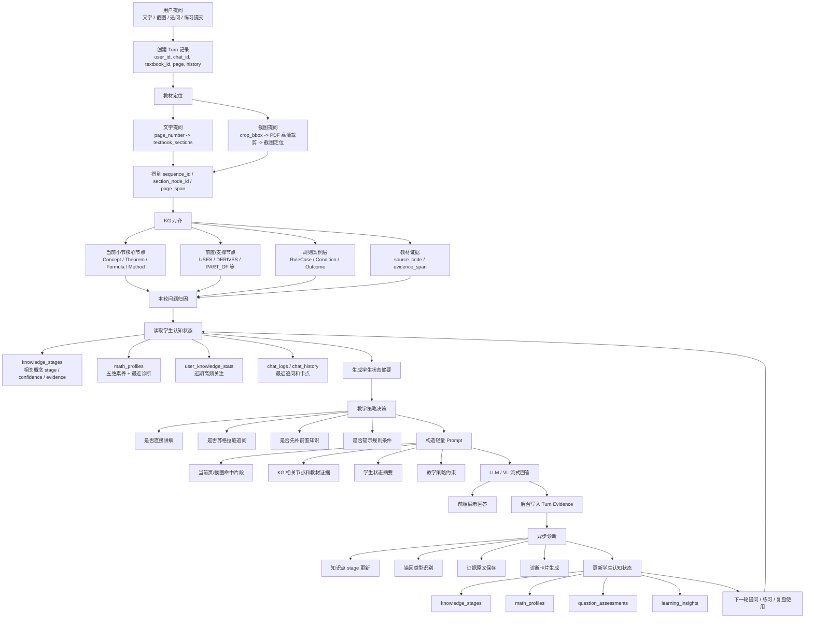

# 待修改对齐的流程

本文档用于对齐“学数有道”学生认知系统的目标链路。后续代码修改应尽量围绕本文档收束，避免继续堆功能但认知诊断链路不闭合。

## 一、目标

系统的主线不应只是“用户提问，模型回答”，而应是：

> 用户行为 -> 教材定位 -> KG 对齐 -> 学生状态读取 -> 教学回答 -> 证据沉淀 -> 诊断更新 -> 下一轮个性化

也就是说，LLM 负责讲解、归纳和表达，但系统判断学生卡在哪里，必须落到可追踪证据：

- 教材位置
- KG 节点
- 学生原话
- 截图/页面片段
- 练习作答
- 错因类型
- stage 变化

## 二、理想主流程



## 三、核心中间对象

### 1. turn_grounding

`turn_grounding` 是本轮提问的“认知定位结果”。它回答：这次提问发生在教材哪里，关联哪些 KG 节点，能引用哪些教材证据。

示例：

```json
{
  "sequence_id": "V1-C04-S04",
  "textbook_id": "高代上-丘维声",
  "section_node_id": "gaodai_shang:C04:S04",
  "related_concepts": ["伴随矩阵", "可逆矩阵", "逆矩阵"],
  "prerequisite_concepts": ["行列式", "矩阵乘法", "单位矩阵"],
  "rule_cases": [
    {
      "name": "逆矩阵存在判定",
      "condition": "|A| != 0",
      "outcome": "A 可逆"
    }
  ],
  "evidence_spans": [
    {
      "source_code": "gaodai_shang:C04:S04:U01",
      "text": "教材原文片段"
    }
  ],
  "confidence": 0.86
}
```

### 2. student_state_summary

`student_state_summary` 是给 Prompt 和诊断共用的“学生当前状态摘要”。它回答：系统现在认为学生处在什么状态，应该怎么教。

示例：

```json
{
  "current_section_stage": 2,
  "weak_prerequisites": [
    {
      "name": "行列式",
      "stage": 1,
      "evidence": "最近多次追问符号来源"
    }
  ],
  "recent_pattern": "连续追问公式中某一步为何成立",
  "likely_breakpoint": "没有把伴随矩阵公式与行列式非零条件连接起来",
  "teaching_policy": "先补条件，再解释公式，不直接跳到完整证明"
}
```

### 3. cognitive_evidence

`cognitive_evidence` 是诊断可信度的基础。每一次 stage 更新、错因判断、画像变化都应该有证据。

示例：

```json
{
  "source": "qa_turn",
  "chat_id": "uuid",
  "sequence_id": "V1-C04-S04",
  "concept_name": "伴随矩阵",
  "quote": "为什么就直接提出伴随矩阵了，什么意思？",
  "diagnosis": "知道公式出现，但不理解引入动机",
  "stage_before": 2,
  "stage_after": 2,
  "confidence_delta": 0.08,
  "created_at": "2026-07-02T00:00:00"
}
```

## 四、Prompt 目标形态

理想 Prompt 不再塞整节教材全文，而是放轻量、高相关、可溯源的信息：

1. 当前页或截图命中的教材片段。
2. KG 对齐到的 3-8 个关键节点。
3. 必要的前置缺口。
4. 规则案例的条件和结论。
5. 学生状态摘要。
6. 最近 1-3 轮真正相关的追问。

回答策略应由 `student_state_summary` 控制，而不是只靠大模型自由发挥。

## 五、诊断更新目标

每次回答结束后，后台应沉淀以下内容：

- 本轮关联了哪些 KG 节点。
- 学生暴露了什么卡点。
- 判断依据是哪句学生原话或哪段作答。
- 这个判断来自文字提问、截图、练习提交，还是提示依赖。
- 对哪个概念的 stage 有影响，影响幅度和置信度是多少。
- 是否生成诊断卡片。

理想的 `knowledge_stages` 不只是：

```text
概念名 = 伴随矩阵，stage = 2
```

而应当包含：

```text
概念名 = 伴随矩阵
stage = 2
confidence = 0.62
evidence = [
  {
    "source": "qa_turn",
    "chat_id": "...",
    "quote": "为什么就直接提出伴随矩阵了，什么意思？",
    "diagnosis": "知道公式出现，但不理解引入动机",
    "time": "..."
  }
]
```

## 六、当前系统与目标链路的主要差距

### 1. stage 命名空间没有统一

当前问答链路中，`student_stage` 主要用 `chapter_name` 查询 `knowledge_stages`。但 `knowledge_stages` 设计上应存 KG 概念名。章节名和概念名不是同一命名空间，导致经常只能回退到全局平均 stage。

### 2. 诊断证据没有完整保存

诊断 Prompt 要求 LLM 输出 `concept_stages[].evidence`，但后续写入 `knowledge_stages` 时主要保存 `name` 和 `stage`，证据没有成为长期状态的一部分。

### 3. question_assessments 信息保存不足

数据库里已有 `sequence_id` 和 `summary` 列，但当前保存函数主要展平 15 维分数和 weak_points。诊断轨迹缺少“在哪一节、为什么判断”的说明。

### 4. KG 结构性资产没有接入诊断卡片

`kg_v44.py` 已能返回 `source_code` 和 `evidence_span`，但路由层和前端没有展示。规则案例层也还没有应用层查询入口。

### 5. 问答、诊断、练习的证据语义不统一

问答写 `chat_logs`，诊断写 `math_profiles` / `question_assessments` / `knowledge_stages`，练习错因分析写 `error_analysis` 并可能更新 stage。三条线都有价值，但没有统一沉淀为 `cognitive_evidence`。

### 6. Prompt 太重

当前 Prompt 倾向于把整节教材内容放进去。高代、高数部分章节内容较长，会拖慢首 token，也会稀释 KG 和学生状态信号。

## 七、改造优先级

### P0：先补闭环，不做大重构

1. 统一“本轮定位”对象：新增内部 `turn_grounding` 构造函数。
2. 问答时按 KG 概念集合读取 stage，而不是只按章节名查。
3. 保存诊断 evidence、summary、sequence_id。
4. `knowledge_stages.evidence` 开始追加本轮证据。
5. 诊断卡片先展示：概念、stage、证据原话、教材出处。

### P1：接入 KG 结构化能力

1. 使用 `source_code` 和 `evidence_span` 生成可溯源诊断。
2. 新增规则案例查询函数，如 `get_rule_cases_for_node`。
3. 错因分析时引入规则案例条件检查。

### P2：优化问答性能

1. Neo4j driver 单例化。
2. 白名单、前置候选增加缓存。
3. Prompt 改为“当前页片段 + KG 证据 + 学生状态摘要”。
4. 移除 token 级 `sleep(0.05)`。
5. SSE heartbeat 和真正异步/线程化流式输出。

## 八、验收标准

改造后，至少应能跑通以下演示闭环：

1. 学生在高代“伴随矩阵/逆矩阵”页面追问。
2. 系统定位到 `V1-C04-S04` 和相关 KG 节点。
3. 系统判断学生可能卡在“伴随矩阵公式与可逆条件的连接”。
4. 回答中按学生状态选择讲解策略。
5. 后台保存证据原话、教材出处、概念 stage 更新。
6. 画像页出现诊断卡片，能看到判断依据。
7. 系统推荐一个针对练习。
8. 学生提交练习后，错因或掌握提升能回写到同一套认知状态。

