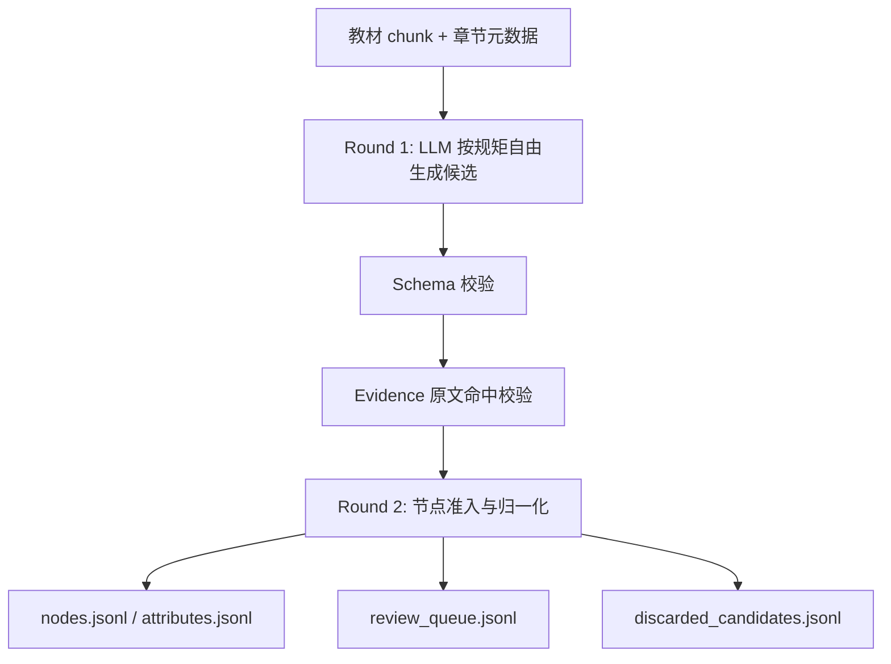

# 智学助手教材知识图谱建构 v4.1 修改方案

> 2026-06-14
> 目标：围绕智学助手中 KG 的产品定位，重写教材知识图谱提取流程。

---

## 一、总体判断

### 1.1 KG 在智学助手中的定位

智学助手中的 KG 不是教材全文图谱，也不是数学百科图谱。

> **KG 是面向教学决策的知识导航层和知识边界层。**

它的核心作用是：

1. **防止 AI 超纲**：允许 AI 使用学生已学章节及其前置知识，避免随意调用后续章节内容。
2. **前置知识诊断**：定位学生当前问题背后的直接前置缺口。
3. **练习与复习推荐**：根据薄弱知识点、前置链和适用方法推荐练习路径。
4. **可解释可视化**：展示当前薄弱点的前后置邻域和推荐学习路径，而不是展示完整教材图。

因此，KG 建构不追求把教材所有句子、证明步骤和例题结论都结构化；它追求的是：

```text
少而准、可导航、可诊断、可约束、可解释。
```

### 1.2 知识点定义

> 知识点 = 学生可能需要单独理解、复习、诊断或练习的最小教学单元。

一个对象进入主 KG 节点，至少要满足一条：

- 学生可能单独卡住它。
- 它常作为后续知识的直接前置。
- 它是教材正式定义或命名的对象。
- 它是解题中会反复调用的方法、定理、公式。
- 它能作为练习或诊断目标。
- 它在多个章节或例题中反复出现。
- 它能帮助 AI 判断讲解边界。

知识点不等于教材中出现的每个术语或短语。

例如：

| 对象 | 处理 |
|------|------|
| 矩阵 | 主节点 |
| 矩阵元素 | 主节点 |
| `(i,j)元` | 默认作为"矩阵元素"的 alias / 属性，必要时 review |
| 主元 | 主节点 |
| 自由未知量 | 主节点 |
| 零解 | 若有定义、判别、练习价值则成节点，否则 review |
| 唯一解 / 无解 / 无穷多个解 | 默认属性值，满足升级条件再成节点 |

### 1.3 当前 v4 的问题

当前 v4 方向正确，但实现存在关键偏差：

1. Step 2 把 Round 1 候选抽取和 Round 2 节点决策合并，导致 LLM 一轮做太多事。
2. 典型例题全部跳过 Step 2，但又参与 Step 3 产边，导致边可能漂移。
3. `DERIVED_FROM` 方向和语义不稳定，LLM 混淆"谁用了谁"和"谁推出谁"。
4. `APPLIES_TO` 缺少类型约束，出现 `Concept -> Method` 这种反向边。
5. evidence 只检查长度，没有验证是否来自教材原文。
6. Step 4 主要是合并和去重，还没有成为真正的质量闸门。

v4.1 不做补丁式修复，而是保留旧 v4 作为对照，新建 `正式脚本/v4_1`，按"教学导航 KG"的定位定向重写核心流程。

---

## 二、v4.1 核心口径

> LLM 负责按规矩生成候选，validator 负责准入和归一化。

一句话：**LLM-first，validator-gated**。

不是让规则/正则先捞一批候选，再让 LLM 补漏；而是让 LLM 在章节类型、节点类型、关系类型、evidence 要求和命名规则的约束下，直接从教材文本中自由生成候选。候选不等于入图，最终能不能进入 KG，由后续 validator、normalizer 和 review 流程决定。

核心原则：

- 不让 LLM 一轮完成所有工作。
- 不把规则/正则当作主召回引擎。
- 不让 LLM 直接写 Neo4j。
- 每一步输出 JSONL 中间产物。
- evidence 必须能回到教材原文。
- 低置信度和冲突样本进入 review，不污染最终图。
- review 队列可以引入第二轮 LLM 辅助复核，但第一阶段只输出建议，不直接覆盖最终图谱。
- 图谱不要求完整复刻教材，但自动入图部分必须可靠。

规则/正则的职责是：

- 判断章节类型：内容精华、典型例题、习题。
- 维护 chunk、章节号、标题、锚点和 source_label。
- 校验 JSON schema、字段枚举和类型方向。
- 校验 evidence_span 是否命中教材原文。
- 校验 ProblemClass 命名、编号名残留、例题禁区、边方向等硬约束。
- 做同名归并、别名归并、冲突检测和 review 分流。

也就是说：

```text
LLM 负责发现和表达候选；
validator 负责判断候选能不能入图；
normalizer 负责把能入图的候选合并成稳定节点和关系。
LLM review assistant 负责对灰区样本给出复核建议，但不能绕过硬规则直接入图。
```

### 2.1 来源边界

v4.1 只使用教材内来源。

- 不引入外部数学百科作为节点真源。
- 不使用外部本体自动补节点。
- LLM 可以做语义命名和判断，但 evidence 必须回到教材文本。

### 2.2 建图策略

先每本教材分别建图，再做统一归并。

这样可以：

- 保留不同教材的章节来源。
- 对比同一知识点在不同教材中的出现位置和命名。
- 降低一开始全局归并造成误合并的风险。

### 2.3 产品优先级

KG 消费优先级：

```text
防超纲 > 前置诊断 > 练习/复习推荐 > 可视化 > 证明依赖分析
```

因此，`PREREQUISITE_OF` 和 `APPLIES_TO` 是主导航关系；`DERIVED_FROM` 是辅助关系，必须收窄。

---

## 三、节点类型

v4.1 使用 6 类节点：

| 类型 | 含义 |
|------|------|
| `Definition` | 教材正式定义的对象、性质、操作 |
| `Concept` | 重要数学术语，但不是正式定义/定理/公式/方法 |
| `Theorem` | 定理、推论、命题、引理的语义化结论 |
| `Formula` | 可复用公式或公式模板 |
| `Method` | 算法、变换、解法、计算技巧 |
| `ProblemClass` | 问题类型，如"行列式计算问题""线性方程组求解问题" |

保留 `Definition`，不并入 `Concept`，因为它标识"教材正式定义过"。

### 3.1 ProblemClass 的受控边界

`ProblemClass` 是应用目标类型，主要作为 `APPLIES_TO` 的 target，不是普通概念。

命名规则：

```text
核心对象 + 任务动词 + 问题
```

任务动词限定为：

```text
计算 / 求解 / 判定 / 证明 / 化简 / 表示 / 构造
```

正例：

- 行列式计算问题
- 线性方程组求解问题
- 矩阵化简问题
- 数域判定问题

反例：

- 行列式计算
- 计算行列式的方法
- 例1问题
- 综合问题

硬规则：

- `ProblemClass` 名称必须以"问题"结尾。
- `ProblemClass` 不参与 `DERIVED_FROM`。
- `ProblemClass` 主要作为 `APPLIES_TO` target。

---

## 四、章节类型处理

### 4.1 内容精华

正常参与全部流程：

- Step 2：LLM 受控自由生成候选（Round 1）
- Step 3：节点准入与归一化
- Step 4：LLM 生成关系候选（Round 2）
- Step 5：关系准入 + 全局归并与硬校验

### 4.2 典型例题

典型例题不直接产正式核心节点。在 Step 2（节点候选）只产 `method_candidate` / `problem_class_candidate` / `evidence_only` / `review`；应用证据只在 Step 4（关系候选）阶段作为 `edge_scope: "example_application"` 出现。

允许：

- `method_candidate`
- `problem_class_candidate`

禁止：

- 产出 `Definition / Concept / Theorem / Formula` 核心节点
- 产出 `DERIVED_FROM`
- 把例题结论当成定理

例题中的方法候选必须经过 validator 才能升级为 `Method` 节点。

升级条件满足任一：

- 原文出现"方法 / 法 / 算法 / 技巧 / 步骤 / 思路 / 计算"等方法信号。
- 多个例题反复出现同一解法。
- 方法名称能稳定表述为"用 X 计算/求解/判定 Y"。
- 证据是可复用操作过程，而不是例题结论。

可升级为 `Method` 的例子：

- 加边法计算行列式
- 递推关系法计算行列式
- 利用范德蒙行列式计算行列式

不能升级为 `Method` 的例子：

- 把第一列减到其他列
- 令 x = a - b
- 观察第 3 行为零
- Q(√2) 是一个数域
- E 不是数域

典型例题升级后的方法节点和应用边必须标注：

```json
{
  "source_scope": "example",
  "edge_scope": "example_application"
}
```

### 4.3 习题

完全跳过：

- 不产节点
- 不产边
- 不作为 evidence 来源

---

## 五、Step 2：候选生成与节点准入

Step 2 不再采用"规则/正则先抽候选，LLM 再补漏"的方式。

新的流程是：



### 5.1 Step 2 · Round 1：LLM 受控自由生成候选

Round 1 使用 LLM，从 chunk 中直接生成候选。它不是补漏器，而是主候选生成器。

输入必须包含：

- chunk 原文。
- 教材、章、节、小节、标题、source_label。
- 章节类型：`core_content`、`example`、`exercise`。
- 允许节点类型和禁止节点类型。
- 命名规则、属性值升级条件、典型例题禁区、evidence 要求。

Round 1 要做：

- 发现可能进入 KG 的知识点候选。
- 给出建议语义名，而不是直接使用"定理1""公式2"这类编号名。
- 给出建议类型：`Definition / Concept / Theorem / Formula / Method / ProblemClass`。
- 判断候选角色：`core_node`、`attribute_value`、`method_candidate`、`problem_class_candidate`、`evidence_only`、`review`。
  > **注意：`application_evidence` 不出现在节点候选角色中。** 它是边的元数据（`edge_scope: "example_application"`），在 Round 3（关系候选生成）中使用。详见 8.4 节。
- 给出原文连续片段 `evidence_span`。
- 给出置信度和候选理由。

Round 1 不做：

- 不决定最终入图。
- 不做全局同义归并。
- 不生成最终 node_id。
- 不生成正式边。
- 不调用外部资料补节点。
- 不把 LLM 总结句写进 `evidence_span`。

输出：`raw_node_candidates.jsonl`

候选示例：

```json
{
  "candidate_id": "C02-S04-A03-cand-001",
  "suggested_name": "矩阵可经初等行变换化为阶梯形矩阵",
  "suggested_type": "Theorem",
  "candidate_role": "core_node",
  "raw_label": "定理2",
  "source_label": "定理2(§2.4)",
  "source_scope": "core_content",
  "section_key": "C02-S04:2.4.1 内容精华",
  "evidence_span": "任意矩阵可经初等行变换化为阶梯形矩阵",
  "confidence": 0.86,
  "candidate_reason": "编号定理包含可复用结论，编号不适合作为实体名，因此生成语义名"
}
```

典型例题 chunk 的 Round 1 只能生成：

- `Method` 候选
- `ProblemClass` 候选
- `evidence_only`
- `review`

> `application_evidence` 已从节点候选角色中删除。例题中"用某方法计算"的证据，在 Round 3 通过 `edge_scope: "example_application"` 承载，不经过 Step 2。

典型例题 chunk 禁止生成：

- `Definition`
- `Concept`
- `Theorem`
- `Formula`
- `DERIVED_FROM`

习题 chunk 直接跳过，不进入 Round 1。

### 5.2 Step 3：节点准入与归一化

节点准入不负责补漏，也不重新"自由发明"候选。它只处理 Round 1 已给出的候选。

候选被准入为：

| decision | 含义 |
|----------|------|
| `CREATE_NODE` | 生成主 KG 节点 |
| `ATTRIBUTE_VALUE` | 作为某节点或关系的属性值 |
| `EVIDENCE_ONLY` | 只作为证据，不成节点 |
| `DISCARD` | 丢弃 |
| `REVIEW` | 人工复核 |

节点准入的判断优先由 validator 完成：

- `evidence_span` 是否命中原文。
- `suggested_name` 是否仍是"定理1/公式2/命题3"这类编号名。
- `source_scope=example` 是否违规产出核心节点。
- `ProblemClass` 是否以"问题"结尾。
- 属性值是否满足升级条件。
- 类型是否属于允许枚举。
- 同一 chunk 内是否重复候选。
- 与已有节点是否同名、近义或冲突。

同义归并也放在 Step 3（节点准入）完成，流程为：

1. **BGE 粗筛**：对所有准入节点名做向量化（BGE-M3），余弦相似度 > 0.85 的对进入候选。
2. **LLM 确认**：对候选对调用 DS Flash 判断是否同义词，确认后合并。
3. **归并**：同义词指向 canonical 名，aliases 合并，all_sections 合并。

将同义归并提前到节点准入，确保 Step 4（边候选生成）时节点列表已是归并后的，减少"同一概念的关系分散在不同名字下"。BGE 粗筛避免了 O(n²) 的 LLM 调用。

Round 2 不自动裁决命名冲突（同名不同类型 → review），但 LLM 可用于同义词确认。它仍然不能补新增候选；新增候选只能来自 Round 1 或补充候选机制。

输出：

- `node_decisions.jsonl`
- `nodes.jsonl`
- `attributes.jsonl`
- `discarded_candidates.jsonl`
- `review_queue.jsonl`

### 5.3 Step 3b：LLM 辅助复核节点（新增）

Step 3b 不替代 Step 3 的 validator，也不直接修改 `nodes.jsonl`。它只面向 Step 3 产出的灰区样本，生成结构化复核建议，供人工或后续保守采纳脚本使用。

输入：

- `review_queue.jsonl`
- `merge_review_queue.jsonl`
- `attribute_parent_review.jsonl`
- `chunks.jsonl`
- `nodes.jsonl`

输出：

- `llm_node_review_suggestions.jsonl`
- `llm_merge_review_suggestions.jsonl`
- `llm_attribute_review_suggestions.jsonl`
- `llm_node_review_report.md`

复核范围：

| 队列 | LLM 辅助判断内容 |
|------|------------------|
| `review_queue.jsonl` | 命名是否合理、类型是否应调整、是否应作为属性值、是否应继续人工复核 |
| `merge_review_queue.jsonl` | 疑似同义、上下位、粒度重叠是否应合并 |
| `attribute_parent_review.jsonl` | 属性值应挂到哪个父知识点，或是否应升级为独立知识点 |

建议动作限定为：

```text
APPROVE / REVISE / REJECT / KEEP_REVIEW
```

每条建议必须包含：

```json
{
  "item_id": "候选或复核项 id",
  "review_type": "node | merge | attribute",
  "llm_action": "APPROVE",
  "proposed_name": "",
  "proposed_type": "",
  "proposed_parent_node": "",
  "merge_target_node_id": "",
  "rule_basis": ["命名规则", "属性值升级规则"],
  "reason": "为什么这样建议",
  "confidence": 0.86,
  "hard_rule_issues": [],
  "requires_human": false
}
```

硬约束：

- LLM 复核不能放行 evidence 不命中的候选。
- LLM 复核不能把典型例题结论升级为 `Definition / Concept / Theorem / Formula`。
- LLM 复核不能绕过 `ProblemClass` 命名规则。
- LLM 复核不能直接改写 `nodes.jsonl`、`attributes.jsonl` 或 `node_decisions.jsonl`。
- 第一阶段不做自动采纳，只生成建议和报告。

后续若建议质量稳定，可再新增：

```text
03c_apply_llm_node_review.py
```

只在保守条件下半自动采纳，例如：`confidence >= 0.85`、无硬规则问题、证据命中、建议动作不是大幅改写。

### 5.4 实现细节（2026-06-15 确认）

**evidence_span 原文命中校验**

两层匹配：

1. 子串 fuzzy 匹配（difflib.SequenceMatcher，阈值 0.85）：覆盖标点差异和少量文字调整。
2. 若 fuzzy 不命中，调用一次轻量 LLM（DS Flash，temperature=0）判断"该 span 是否为原文的近似引用"。不再作为 evidence 存入，降级为 `review`。

**Method 升级策略**

Round 1 LLM 宽松生成 Method 候选（包括例题中所有"可能可复用"的操作），Round 2 validator 按 4.2 节的升级条件收紧。LLM prompt 中只给正反例参考，不做硬拒绝。

**跨 chunk 不共享候选列表**

Round 1 每个 chunk 独立调用 LLM，不传入前面 chunk 已生成的候选。LLM 上下文有限，传入节点列表会挤占原文空间、降低质量。跨 chunk 同名重复交由 Round 2 归一化处理。

**补充候选机制**

Step 4（边候选生成）输出 `supplement_candidates`，Step 5 直接调用 Step 3 的同义检查模块处理（BGE 向量空间中计算相似度 + LLM 确认），不同义则新建节点，更新边引用，随后继续边校验。一次跑完，不重跑 Step 3。

**同义归并（BGE + LLM）**

从 Step 5 提前到 Step 3，确保边候选生成时节点列表已是归并后的：

1. BGE-M3 向量化所有节点名 → 余弦相似度 > 0.85 的对进入候选。
2. DS Flash 逐对确认是否同义词。
3. 归并到 canonical 名，aliases 和 all_sections 合并。

**attributes.jsonl 格式**

每个属性值单独一行，便于后续扩展：

```json
{"parent_node": "线性方程组解的情况", "attribute": "solution_case", "value": "唯一解", "evidence_span": "...", "confidence": 0.88}
{"parent_node": "线性方程组解的情况", "attribute": "solution_case", "value": "无解", "evidence_span": "...", "confidence": 0.88}
```

---

## 六、定理/公式命名

核心原则：

> 编号不是实体名，编号只进入 `source_label` 或 `aliases`。

正确：

```json
{
  "name": "矩阵可经初等行变换化为阶梯形矩阵",
  "type": "Theorem",
  "source_label": "定理1(§1.1)",
  "aliases": ["矩阵化为阶梯形"]
}
```

错误：

```json
{
  "name": "定理1",
  "type": "Theorem"
}
```

语义名推荐格式：

```text
对象 + 条件/操作 + 结论
```

---

## 七、属性值升级

默认规则：

> 某个分类维度下的取值默认作为属性值，不单独成节点。

例如：

```text
线性方程组解的情况.solution_case = 唯一解 / 无穷多个解 / 无解
```

满足任一条件升级为节点：

1. 教材对该状态单独给出定义。
2. 有独立判别准则。
3. 后文以它为主题展开。
4. 在全局图中需要作为多个关系的桥节点。

---

## 八、关系类型与方向

v4.1 只保留三类关系。

| 关系 | 方向 | 含义 |
|------|------|------|
| `PREREQUISITE_OF` | 前置知识 → 后学知识 | A 是理解 B 的直接必要前置 |
| `DERIVED_FROM` | 来源结论 → 被推出结论 | B 明确由 A 推出、改写、特殊化、证明得到 |
| `APPLIES_TO` | 工具知识 → 适用对象/问题类 | A 可用于处理 B |

同一对节点允许多种关系并存，但必须满足：

- 每条关系有独立的 `evidence_spans`。
- 每条关系有独立的 `inference_rationale`。
- 不能用同一段模糊 evidence 硬凑多种关系。
- 消费端按关系类型分层使用。

默认消费方式：

| 使用场景 | 优先关系 |
|----------|----------|
| 防超纲 | `chapter` 属性过滤 + `PREREQUISITE_OF` |
| 前置诊断 | `PREREQUISITE_OF` |
| 练习/复习推荐 | `APPLIES_TO` + `PREREQUISITE_OF` |
| 可视化 | 薄弱点邻域 + 推荐路径 |
| 证明来源解释 | `DERIVED_FROM` |

### 8.1 PREREQUISITE_OF

三层规则：

1. **直接前置且原文明确** → 自动保留，标记 `explicit_prerequisite: true`。教材原文直接说明"A 是理解 B 的前提"或"A 先于 B 引入且 B 的定义/证明引用 A"。
2. **A→B、B→C 都成立，教材原文也明确说"A 是 C 的前置"** → 保留 A→C，标记 `explicit_prerequisite: true`。这是教材有意显式标注的传递关系，有教学诊断价值。
3. **LLM 自动推断出的传递边**（仅有 A→B、B→C，无 A→C 的直接证据）→ 不进图。

示例：

```text
代数余子式 -> 按一行展开法（直接，原文明确）
按一行展开法 -> 克莱姆法则（直接，原文明确）
代数余子式 -> 克莱姆法则（LLM 推断，无直接证据 → 不进图）
```

### 8.2 DERIVED_FROM

定义：

```text
A -[:DERIVED_FROM]-> B
表示 B 是由 A 明确推出、改写、特殊化或证明得到。
```

允许场景：

- "由定理 A 可得 B"
- "根据公式 A 推出 B"
- "把定理 A 中的行换成列，得到 B"
- "定理 B 的证明明确引用定理 A"

禁止场景：

- 典型例题中"用了某性质"
- 只是计算时使用某方法
- 只是概念相关
- 只是 evidence 中提到两个节点

典型例题默认禁止产 `DERIVED_FROM`。

### 8.3 APPLIES_TO

定义：

```text
A -[:APPLIES_TO]-> B
表示 A 是工具性知识，可用于处理 B。
```

允许方向：

```text
Method / Formula / Theorem -> Concept / ProblemClass
```

示例：

```text
按一行展开法 -> 行列式计算问题
克莱姆法则 -> 系数行列式非零的线性方程组
高斯-约当消元法 -> 线性方程组求解问题
```

默认禁止：

```text
Concept -> Method
Concept -> Formula
Concept -> Theorem
```

例如：

```text
n阶行列式 -> 按一行展开法
```

应改为：

```text
按一行展开法 -> n阶行列式
```

或更自然地：

```text
按一行展开法 -> 行列式计算问题
```

### 8.4 关系候选生成与准入

关系也采用同一原则：LLM 生成候选，validator 决定准入。

#### Step 4 · Round 2 输入

- 当前 chunk 原文。
- 当前 chunk 所属章节信息。
- **Node Pool**（非全量已准入节点）：

> 不把全部已准入节点塞给 LLM。每个 chunk 构造一个节点池，默认上限 30 个，极限 50 个。节点卡片只给 `id / name / type / source_label / aliases / 一句话释义`。

按关系类型分池：

| 关系类型 | 节点池偏向 | 原因 |
|----------|-----------|------|
| `PREREQUISITE_OF` | 本 chunk + 邻近 chunk + 章节锚点 | 前置关系通常近邻 |
| `DERIVED_FROM` | 定理/公式/命题锚点 | 推导关系需要定理源 |
| `APPLIES_TO` | 方法/问题类节点 | 应用关系需要工具节点 |

- 关系类型定义、方向定义、禁止场景和 evidence 要求。

#### Step 4 · Round 2 要做

- 只在节点池内生成关系候选。
- 给出关系类型：`PREREQUISITE_OF / DERIVED_FROM / APPLIES_TO`。
- 给出 `source`、`target`、`evidence_spans`、`inference_rationale`、`confidence`。
- 对 `DERIVED_FROM` 遵循方向规则（见下）。
- 对 `APPLIES_TO` 明确说明"工具知识用于处理什么对象或问题类"。
- 发现已准入节点列表缺失重要节点时，输出 `supplement_candidates`——每个必须有独立 `evidence_span`，且来自当前 chunk 原文。数量异常高时整批进 review。

#### Step 4 · Round 2 不做

- 不新建正式节点。
- 不产最终边。
- 不用"文本先出现"推断 `PREREQUISITE_OF`。
- 不把例题中的使用关系写成 `DERIVED_FROM`。
- 不把 LLM 总结句写进 `evidence_spans`。

#### DERIVED_FROM 方向：Prompt + Validator 双保险

Prompt 中写死：

- `source = 推出依据`（被引用的定理/公式/定义）
- `target = 被推出结论`（新结论/特殊化/推论）
- 不要按文本出现顺序决定方向
- "由 A 可得 B"、"根据 A 推出 B"、"利用 A 证明 B" → 一律输出 `A → B`
- 配 2 组正例 + 2 组反例

Validator 再做方向镜像检查：

- 若 `evidence_spans` 中明确出现"由 A 可得 B"但 edge 写成 `B → A`，翻回 `A → B` 或进 review。

#### supplementary_candidates

LLM 在 Step 4 直接输出，不靠 validator 回头找。

约束：

- 只允许来自当前 chunk 的明确原文。
- 每个补充候选必须有独立 `evidence_span`。
- 数量很少（默认 ≤ 3/chunk），超阈值则整批进 review 不自动补充。
- 补充候选由 Step 5 直接处理（复用 Step 3 同义检查模块），不重跑 Step 3。
- **补充候选不能直接进入最终图**。必须写入 `supplement_node_decisions.jsonl`，通过完整准入校验（evidence_span 命中原文、类型合规、命名合规、置信度 ≥ 0.80）后才可入图；否则进 review。

#### Step 5 关系准入（Validator）

- `source` 和 `target` 必须命中已准入节点。
- 不允许自环边。
- 关系方向必须符合类型约束（DERIVED_FROM 方向检查见上）。
- `evidence_spans` 必须命中教材原文。
- `source_scope=example` 禁止产出 `DERIVED_FROM`。
- `ProblemClass` 禁止参与 `DERIVED_FROM`。
- `APPLIES_TO` 必须满足 `Method / Formula / Theorem -> Concept / ProblemClass`。
- `PREREQUISITE_OF` 按 8.1 节三层规则：直接前置保留，原文明确支持的长程前置保留（`explicit_prerequisite: true`），LLM 推断的传递边不进图。

#### Step 5c：LLM 辅助复核关系（新增）

Step 5c 面向 `edge_review_queue.jsonl`，用于对关系灰区样本给出第二轮复核建议。它不替代 Step 5 validator，也不直接改写 `validated_edges*.jsonl`。

输入：

- `edge_review_queue.jsonl`
- `chunks.jsonl`
- `nodes.jsonl`
- `validated_edges.jsonl`

输出：

- `llm_edge_review_suggestions.jsonl`
- `llm_edge_review_report.md`

复核内容：

| 问题 | LLM 辅助判断内容 |
|------|------------------|
| 关系方向 | `DERIVED_FROM` 是否写反，`A -> B` 是否符合"来源结论 → 被推出结论" |
| 关系类型 | 当前关系更像 `PREREQUISITE_OF`、`DERIVED_FROM`、`APPLIES_TO`，还是不应保留 |
| 关系分层 | 是否应进入 `main`、`proof_trace`、`application_index`，或继续人工复核 |
| 证据解释 | `evidence_spans` 是否足以支持该关系，是否只是概念相关或文本共现 |
| 例题应用 | 典型例题关系是否只应作为应用索引，不应进入主导航图 |

建议动作限定为：

```text
APPROVE / REVISE_TYPE / REVISE_DIRECTION / REVISE_LAYER / REJECT / KEEP_REVIEW
```

每条建议必须包含：

```json
{
  "edge_candidate_id": "边候选 id",
  "llm_action": "REVISE_TYPE",
  "proposed_type": "DERIVED_FROM",
  "proposed_source_node_id": "",
  "proposed_target_node_id": "",
  "proposed_layer": "proof_trace",
  "rule_basis": ["DERIVED_FROM 方向规则", "主导航图强前置标准"],
  "reason": "为什么这样建议",
  "confidence": 0.82,
  "hard_rule_issues": [],
  "requires_human": false
}
```

硬约束：

- LLM 复核不能放行 source/target 不在 `nodes.jsonl` 中的边。
- LLM 复核不能放行自环边。
- LLM 复核不能放行 evidence_spans 不命中的边。
- LLM 复核不能让典型例题 chunk 产出 `DERIVED_FROM`。
- LLM 复核不能让 `ProblemClass` 参与 `DERIVED_FROM`。
- LLM 复核不能让 `APPLIES_TO` 突破 `Method / Formula / Theorem -> Concept / ProblemClass` 的方向约束。
- 第一阶段不做自动采纳，只生成建议和报告。

后续若建议质量稳定，可再新增：

```text
05d_apply_llm_edge_review.py
```

只在保守条件下半自动采纳，例如：`confidence >= 0.85`、无硬规则问题、证据命中、仅修改类型/层级/方向中的单一项。

---

## 九、evidence 校验

### 9.1 节点 evidence

节点 evidence 必须是教材原文中的连续片段，或规范化后可 fuzzy match 到原文。

节点 evidence 通常来自：

- 定义句
- 命名句
- 定理/公式原文
- 方法命名或描述句

### 9.2 边 evidence

边不使用单一 evidence 字段，因为边证据经常跨句。改为 `evidence_spans`（数组）：

```json
{
  "evidence_spans": [
    {"role": "primary", "text": "证明中明确表达关系的那句原文"},
    {"role": "auxiliary", "text": "必要时补一段引用上下文"}
  ],
  "inference_rationale": "为什么这些片段支持这条边"
}
```

硬要求：

- **主 span（primary）**必须命中教材原文——不能拿 source 节点的定义句冒充边证据。
- 辅 span（auxiliary）可选，用于补充上下文。
- `inference_rationale` 可以是 LLM 的解释。
- 不能把 LLM 总结句写进 `evidence_spans`。

不合格示例：

- "该定理涉及对换操作。"
- "公式中用到系数行列式。"
- "该性质是展开定理的推论。"
- "例题中隐含使用了该概念。"
- 仅引用 source 节点定义句但未包含关系本身

合格示例：

```json
{
  "source": "拉普拉斯定理",
  "target": "分块三角行列式公式",
  "type": "DERIVED_FROM",
  "evidence_spans": [
    {"role": "primary", "text": "证明 把(6)式左端的行列式按前k行展开"},
    {"role": "auxiliary", "text": "根据拉普拉斯定理，按前k行展开后得到..."}
  ],
  "inference_rationale": "按前k行展开使用的是拉普拉斯定理，因此该公式由拉普拉斯定理推出"
}
```

### 9.3 处理方式

| 情况 | 处理 |
|------|------|
| 节点 evidence_span 或边 evidence_spans 命中原文，置信度 >= 0.80 | 自动保留 |
| 命中原文，置信度 0.60-0.80 | 进入 review |
| 命中原文，置信度 < 0.60 | 丢弃 |
| 不命中原文 | 不自动入图，进入 review 或丢弃 |

---

## 十、置信度阈值

| confidence | 处理 |
|------------|------|
| `>= 0.80` | 自动保留 |
| `0.60 <= confidence < 0.80` | 进入 review，不进最终图 |
| `< 0.60` | 丢弃 |

注意：

> 节点 evidence_span 或边 evidence_spans 不命中原文时，无论 confidence 多高，都不能自动入最终图。

---

## 补充：LLM 辅助复核层落地顺序（2026-06-17 更新）

新增 LLM review assistant 的目标不是取消人工复核，而是先降低人工阅读成本、提高复核队列的可解释性。

第一阶段只做两件事：

1. 对节点复核队列生成结构化建议：`03b_llm_review_nodes.py`。
2. 对关系复核队列生成结构化建议：`05c_llm_review_edges.py`。

第一阶段明确不做：

- 不自动覆盖 `nodes.jsonl`。
- 不自动覆盖 `validated_edges*.jsonl`。
- 不绕过 validator 的硬规则。
- 不把 LLM 对同一批候选的二次判断当成最终裁决。

质量观察方式：

- 从 `llm_node_review_suggestions.jsonl` 抽样 10-20 条，检查命名、类型、属性值、同义合并建议是否稳定。
- 从 `llm_edge_review_suggestions.jsonl` 抽样 10-20 条，检查关系方向、关系类型、分层建议是否稳定。
- 记录高频错误类型，再决定 prompt 或硬规则是否需要调整。

第二阶段可选新增：

```text
03c_apply_llm_node_review.py
05d_apply_llm_edge_review.py
```

但只能在保守条件下半自动采纳：

- `confidence >= 0.85`
- 无硬规则问题
- evidence 命中原文
- 修改幅度小
- 不涉及规则边界变更

涉及知识点粒度标准、属性值升级标准、主导航图强前置标准的样本，仍应保留人工确认。

---

## 补充：Step 5 实现细节（2026-06-14 确认）

`05_validate_and_normalize.py` 负责边准入校验 + 全局归一化。

**LLM 调用约束**

Step 5 不做**抽取型** LLM 调用（不再从原文中发现新候选）。只允许 validator/normalizer 中的**裁判型** LLM 调用：同义确认、命名修正、DERIVED_FROM 方向校验。所有其余校验项均规则化：

- 自环、悬空节点、类型枚举、方向约束、evidence_spans 命中原文、example 禁区、ProblemClass 禁区
- DERIVED_FROM 方向镜像检查：`evidence_spans` 中出现"由 A 可得/B"但 edge 写成 `B → A` → 翻回 `A → B` 或进 review

**PREREQUISITE_OF 传递边处理**

按 8.1 节三层规则：
- 原文明确支持的传递边 → 保留，标记 `explicit_prerequisite: true`
- LLM 推断的传递边（无直接 evidence_spans）→ 不进图

**边去重：只去完全重复**

仅当 `(source, target, type, evidence_spans)` 完全相同时才去重（写入 bug）。不同 evidence_spans 的同类边说明关系在教材多处印证，保留，不做合并。

**补充候选处理：复用 Step 3 同义检查函数，不重跑 Step 3**

补充候选少（≤3/chunk），Step 5 调用 Step 3 的同义检查模块（BGE 向量空间中计算相似度 + LLM 确认），不同义则作为新准入候选，通过完整校验（evidence_span 命中原文、类型合规、命名合规、置信度 ≥ 0.80）后写入 `supplement_node_decisions.jsonl`，更新边引用。不满足条件的进 review，不直接入最终图。一次跑完，不回头。

**validation_report.md 内容**

- 统计：按关系类型分的自动通过/进 review/丢弃数量
- 按原因分组的丢弃摘要
- review 队列边条目清单
- 补充候选处理结果

---

## 补充：Step 6 实现细节（2026-06-14 确认）

`06_import_neo4j.py` 将 nodes.jsonl 和 validated_edges.jsonl 写入 Neo4j。

**不建 Section 节点**

节点已含 `chapter`、`first_section`、`all_sections` 属性。防超纲用 `WHERE n.chapter = "第1章"` 过滤，跨章查询用 `all_sections` 属性即可。额外建 Section 节点 + TEACH_IN 关系不增加查询能力，徒增图复杂度。

**边属性全存**

`evidence_spans`、`inference_rationale`、`confidence`、`edge_scope` 全部写入边属性。Cypher RETURN 什么才返回什么——不 RETURN 的属性不影响遍历性能。需要看证据时点开一条边即可。

**节点属性**

只存 `name / type / source_label / aliases / chapter / first_section / all_sections / evidence_span / anchor_id`。不存 `evidence_list`（中间产物字段，入库无用）。

**连接方式**

待定（Neo4j Desktop 本地 DBMS 密码需确认，或生成 Cypher 文件手动导入）。

---

## 十一、输出产物

新建目录：

```text
教材提取模块/
  正式脚本/
    v4_1/
      01_split_textbook.py
      02_generate_node_candidates.py
      03_accept_and_normalize_nodes.py
      03b_llm_review_nodes.py
      04_generate_edge_candidates.py
      05_validate_and_normalize.py
      05c_llm_review_edges.py
      06_import_neo4j.py
      prompts/
      schemas/
      中间产物/
```

中间产物：

```text
chunks.jsonl
raw_node_candidates.jsonl
node_decisions.jsonl
nodes.jsonl
attributes.jsonl
discarded_candidates.jsonl
review_queue.jsonl
merge_review_queue.jsonl
attribute_parent_review.jsonl
llm_node_review_suggestions.jsonl
llm_merge_review_suggestions.jsonl
llm_attribute_review_suggestions.jsonl
llm_node_review_report.md
raw_edge_candidates.jsonl
edge_decisions.jsonl
validated_edges.jsonl
discarded_edges.jsonl
validated_edges_main.jsonl
validated_edges_trace.jsonl
validated_edges_application.jsonl
edge_review_queue.jsonl
llm_edge_review_suggestions.jsonl
llm_edge_review_report.md
validation_report.md
```

旧目录 `正式脚本/v4` 保留不覆盖，用于对比。

---

## 十二、首轮运行范围

先只跑第 1 章和第 2 章。

目标不是追求数量，而是验证：

- 编号实体名是否清零。
- 典型例题是否只产方法层节点和应用边。
- `DERIVED_FROM` 方向是否稳定。
- `APPLIES_TO` 是否不再反向。
- evidence 命中率是否达标。
- `PREREQUISITE_OF` 是否不再满天飞。
- review 队列是否能承接不确定样本。

---

## 十三、验收指标

| 指标 | 目标 |
|------|------|
| 编号名残留 | 0 |
| 悬空边 | 0 |
| 自环边 | 0 |
| evidence_spans 原文命中率 | 100% for auto-kept edges |
| 典型例题 DERIVED_FROM | 0 |

---

## 十四、三层边结构并入 Step 2-5（2026-06-15 更新）

KG 的工程定位服务三类查询：

1. 学生不会某题，追溯缺哪个知识点。
2. 按教材章节生成学习路径。
3. 给某知识点推荐例题、方法、题型。

因此边不再只输出一个混合文件，而是在 Step 4/5 阶段直接进入三层结构：

- `main`：主导航图。只放强标准的 `PREREQUISITE_OF`，以及经过 review 确认的高价值核心 `DERIVED_FROM`。用于诊断、路径和默认图遍历。
- `proof_trace`：证明追踪层。放局部证明依赖、性质链条、定理/公式的推导依据。用于解释“为什么成立”，不进入默认学习路径。
- `application_index`：应用索引层。放所有 `APPLIES_TO`，尤其是典型例题中的方法/题型使用证据。用于从知识点查例题、方法、题型，不进入主导航图。

### Step 2/3 节点逻辑

节点仍按 v4.1 的“LLM 按规矩自由生成 + validator 归一化”执行。粒度可以相对细，但节点是否进入不同业务能力由边层决定：

- `Concept / Definition / Theorem / Formula` 可以参与主导航和证明追踪。
- `Method / ProblemClass` 可以保留，主要服务应用索引和例题推荐。
- 例题中允许产生 `Method / ProblemClass`，禁止产生例题结论型 `Theorem / Formula / Definition / Concept`。

### Step 4 边候选生成

`04_generate_edge_candidates.py` 和 prompt 要求 LLM 输出 `edge_layer_hint`：

```json
{
  "type": "PREREQUISITE_OF",
  "edge_scope": "core_content",
  "edge_layer_hint": "main"
}
```

规则：

- 强标准 `PREREQUISITE_OF` 通常标 `main`。
- 普通 `DERIVED_FROM` 默认标 `proof_trace`；只有教材反复复用、适合作为学习导航的核心推导，才可建议 `main`。
- `APPLIES_TO` 一律标 `application_index`。
- 典型例题 chunk 只允许 `APPLIES_TO`，且必须是 `edge_scope = "example_application"`、`edge_layer_hint = "application_index"`。

### Step 5 验证与输出

`05_validate_and_normalize.py` 负责把 layer 建议变成正式结构：

- 旧 raw 边缺少 `edge_layer_hint` 时，按边类型自动默认分层，保证兼容。
- `APPLIES_TO` 和例题应用边强制进入 `application_index`。
- `PREREQUISITE_OF` 强标准通过后进入 `main`。
- `DERIVED_FROM` 默认进入 `proof_trace`；如果建议进入 `main`，先进入 review，由人工确认是否为高价值核心推导。
- `edge_layer_hint = "review"` 或非法 layer 进入 review。

输出文件：

```text
validated_edges.jsonl                 # 全量通过边，兼容旧流程
validated_edges_main.jsonl            # 主导航图
validated_edges_trace.jsonl           # 证明追踪层
validated_edges_application.jsonl     # 应用索引层
edge_review_queue.jsonl               # 需要人工审批的边
```

Step 6 默认应优先导入 `validated_edges_main.jsonl` 作为主图；`proof_trace` 和 `application_index` 可作为单独索引层或带 `edge_layer` 属性的关系导入，需另行审批。

### Step 6 导入策略更正（2026-06-16 拍板）

以本节为准，覆盖前文旧说法“Step 6 导入 validated_edges.jsonl”：

- `06_import_neo4j.py` 默认边文件已经改为 `validated_edges_main.jsonl`。
- 默认 Neo4j 导入只包含主导航图，用于学习路径和缺漏诊断。
- `validated_edges_trace.jsonl` 是证明追踪层，不默认导入；需要证明解释功能时，再通过 `--edges` 显式指定。
- `validated_edges_application.jsonl` 是应用索引层，不默认导入；需要知识点推荐例题/方法/题型时，再通过 `--edges` 显式指定。
- `validated_edges.jsonl` 和 `validated_edges_reviewed.jsonl` 只作为全量兼容/审阅产物，不作为默认导入源。
| `Concept -> Method` 的 APPLIES_TO | 0 |
| 低置信度入最终图 | 0 |
| `PREREQUISITE_OF` 传递冗余边 | 尽量少，进入 review |
| ProblemClass 非"问题"结尾 | 0 |
| 典型例题产出 Definition/Concept/Theorem/Formula | 0 |
| 边使用 LLM 总结句冒充 evidence_spans | 0 |

---

## 十四、下一步

按本方案定向重写核心模块：

1. `02_generate_node_candidates.py`
2. `03_accept_and_normalize_nodes.py`
3. `04_generate_edge_candidates.py`
4. `05_validate_and_normalize.py`
5. `03b_llm_review_nodes.py`
6. `05c_llm_review_edges.py`

先跑第 1、2 章，生成对比报告和 LLM 复核建议后，再决定是否扩展到全书。LLM 复核建议第一阶段只供人工查看，不自动采纳。
---

## 补充：LLM 辅助复核层落地记录（2026-06-17）

本次已将 review 层落实为可运行脚本。该层定位为“第二审阅者/复核建议生成器”，只对 Step 3 与 Step 5 产生的灰区样本给出结构化建议，不直接修改 `nodes.jsonl`、`attributes.jsonl`、`validated_edges*.jsonl`，也不直接写入 Neo4j。

已实现脚本：

```text
正式脚本/v4_1/03b_llm_review_nodes.py
正式脚本/v4_1/05c_llm_review_edges.py
正式脚本/v4_1/prompts/node_review_assistant.md
正式脚本/v4_1/prompts/edge_review_assistant.md
```

脚本支持通过 `--input-dir` 指定任意章节的中间产物目录。默认读取 `chunks.jsonl`、`nodes.jsonl`、节点或关系 review 队列，并输出 LLM 复核建议文件与报告。

节点复核命令示例：

```powershell
python 正式脚本/v4_1/03b_llm_review_nodes.py --input-dir 正式脚本/v4_1/中间产物 --dry-run --limit 5
python 正式脚本/v4_1/03b_llm_review_nodes.py --input-dir 正式脚本/v4_1/中间产物 --limit 5
```

关系复核命令示例：

```powershell
python 正式脚本/v4_1/05c_llm_review_edges.py --input-dir 正式脚本/v4_1/中间产物 --dry-run --limit 5
python 正式脚本/v4_1/05c_llm_review_edges.py --input-dir 正式脚本/v4_1/中间产物 --limit 5
```

第二章小样本试运行结果：

- 节点复核样本 5 条，输出 `llm_node_review_suggestions.jsonl` 与 `llm_node_review_report.md`。
- 节点建议分布：`APPROVE` 4 条，`KEEP_REVIEW` 1 条；无解析错误。
- 关系复核样本 5 条，输出 `llm_edge_review_suggestions.jsonl` 与 `llm_edge_review_report.md`。
- 关系建议分布：`KEEP_REVIEW` 4 条，`REVISE_TYPE` 1 条；无解析错误。

从样本看，关系复核助手没有把弱 `PREREQUISITE_OF` 直接放行，而是多数保留人工复核；其中一条“定理证明引用”类关系被建议由 `PREREQUISITE_OF` 改为 `DERIVED_FROM`，符合当前分层规则与方向规则。

当前阶段约束：

- LLM review 只输出建议，不自动采纳。
- `confidence < 0.85`、存在 `hard_rule_issues` 或 `requires_human=true` 的建议仍需人工查看。
- 后续如需半自动采纳，应另写 `03c_apply_llm_node_review.py` 与 `05d_apply_llm_edge_review.py`，并只在证据命中、无硬规则问题、建议动作保守且置信度足够高时执行。
