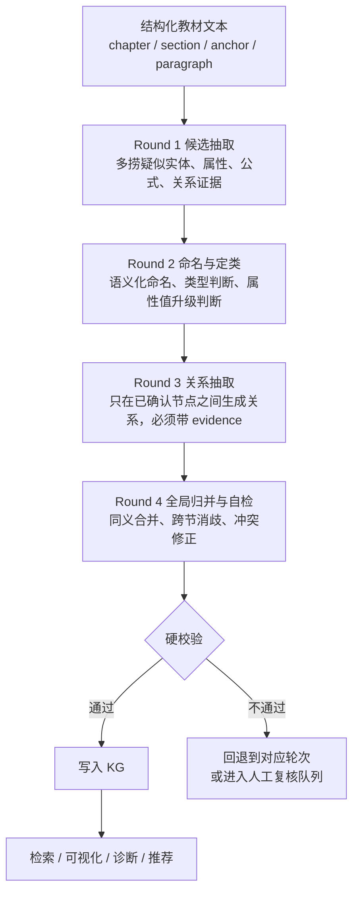

# 教材知识图谱提取规则与流程 v4

> 2026-06-14
> 基于 v3 抽取标准 + 多轮 LLM 受控流程
> 核心变化：从“规则主导抽取”改为“LLM-first，规则做闸门”

---

## 一、总体原则

### 1.1 为什么不用纯规则主导

教材知识图谱抽取的难点不主要是字符串匹配，而是语义判断：

- “定理1”不是最终实体名，但它背后的数学断言可能必须抽。
- “无解”既可能只是“解的情况”的属性值，也可能在有判别准则时升级为实体。
- “方阵”和“m 级矩阵”可能是同义关系，不应生成两个核心节点。
- “推论1”可能只是主定理的直接特例，也可能是后文反复使用的判别准则。
- `PREREQUISITE_OF`、`DERIVED_FROM`、`APPLIES_TO` 不能只靠词面先后判断。

这些问题如果全部靠规则，会导致规则越来越碎、难以维护，也难以迁移到不同教材。

### 1.2 v4 的基本口径

> LLM 负责语义判断，流程负责约束，规则负责拦截坏结果。

也就是说：

- 不让 LLM 一轮完成所有工作。
- 不让 LLM 直接写入图数据库。
- 每一轮只解决一个清晰问题。
- 每一轮输出固定 JSON。
- 最终入库前必须经过硬校验。

### 1.3 最终目标

抽取的是可被学生理解、检索、复习和推理的数学知识对象，而不是教材排版标签。

核心口令：

1. 抽语义对象，不抽排版标签。
2. 抽可复用知识，不抽临时文本。
3. 关系必须有教材原文 evidence。
4. 编号保留为来源标签，不作为实体名。

---

## 二、整体流程



---

## 三、数据分层

v4 不再把 LLM 第一次输出当成最终节点，而是分成四层数据。

| 层 | 含义 | 是否入库 |
|----|------|---------|
| Raw Text | 教材原文块 | 不直接入知识图谱 |
| Candidate | 疑似知识对象、属性值、关系证据 | 不直接入库 |
| Accepted Node / Attribute | 已确认节点或属性 | 可入库 |
| Validated Edge | 已确认关系，带 evidence | 可入库 |

### 3.1 Candidate 示例

```json
{
  "candidate_id": "cand_v1_c01_s01_a05_001",
  "raw_name": "定理1",
  "raw_type": "Theorem",
  "source_label": "定理1(§1.1)",
  "section_id": "V1-C01-S01-U01-T00",
  "anchor_title": "##### 定理1",
  "text": "任意一个矩阵都可以经过一系列初等行变换化为阶梯形矩阵。",
  "evidence": "任意一个矩阵都可以经过一系列初等行变换化为阶梯形矩阵。",
  "origin": "heading",
  "decision": "pending"
}
```

### 3.2 Accepted Node 示例

```json
{
  "node_id": "theorem_matrix_row_reduction_to_echelon_form",
  "name": "矩阵可经初等行变换化为阶梯形矩阵",
  "type": "Theorem",
  "aliases": ["矩阵化为阶梯形", "阶梯形化定理"],
  "source_labels": ["定理1(§1.1)"],
  "section_id": "V1-C01-S01-U01-T00",
  "evidence": "任意一个矩阵都可以经过一系列初等行变换化为阶梯形矩阵。",
  "confidence": 0.92
}
```

### 3.3 Attribute 示例

```json
{
  "parent": "线性方程组解的情况",
  "attribute": "solution_case",
  "value": "无解",
  "evidence": "线性方程组可能无解、有唯一解或有无穷多个解。",
  "section_id": "V1-C01-S01-U04-T00"
}
```

### 3.4 Validated Edge 示例

```json
{
  "source": "初等行变换",
  "target": "矩阵可经初等行变换化为阶梯形矩阵",
  "type": "APPLIES_TO",
  "evidence": "任意一个矩阵都可以经过一系列初等行变换化为阶梯形矩阵。",
  "section_id": "V1-C01-S01-U01-T00",
  "confidence": 0.86
}
```

---

## 四、Round 1：候选抽取

### 4.1 目标

从教材文本块中尽量完整地抽出候选，不做最终判断。

Round 1 的口径是“宁可多捞，但不入库”。

### 4.2 输入

```json
{
  "chapter": "第1章 线性方程组",
  "section": "1.1 消元法",
  "section_id": "V1-C01-S01-U01-T00",
  "anchor_title": "##### 定理1",
  "text": "..."
}
```

### 4.3 输出

```json
{
  "candidates": [
    {
      "raw_name": "定理1",
      "raw_type": "Theorem",
      "source_label": "定理1(§1.1)",
      "evidence": "任意一个矩阵都可以经过一系列初等行变换化为阶梯形矩阵。",
      "reason": "编号定理，包含可复用数学断言"
    }
  ],
  "attribute_candidates": [
    {
      "raw_name": "无解",
      "parent_hint": "线性方程组解的情况",
      "attribute_hint": "solution_case",
      "evidence": "线性方程组可能无解、有唯一解或有无穷多个解。"
    }
  ],
  "relation_evidence_candidates": [
    {
      "source_hint": "初等行变换",
      "target_hint": "阶梯形矩阵",
      "relation_hint": "APPLIES_TO",
      "evidence": "矩阵可经初等行变换化为阶梯形矩阵。"
    }
  ]
}
```

### 4.4 Round 1 不允许做的事

- 不允许给“定理1”直接定最终实体名。
- 不允许生成最终关系边。
- 不允许把候选直接写 Neo4j。
- 不允许凭教材外知识补充候选。

---

## 五、Round 2：命名、定类与属性升级

### 5.1 目标

把 Round 1 的候选变成三类结果：

| decision | 含义 |
|----------|------|
| `CREATE_NODE` | 生成知识节点 |
| `ATTRIBUTE_VALUE` | 作为属性值挂到父概念 |
| `EVIDENCE_ONLY` | 只作为证据，不生成节点 |
| `DISCARD` | 丢弃噪音 |
| `REVIEW` | 进入人工复核 |

### 5.2 节点类型

| 类型 | 定义 |
|------|------|
| `Definition` | 教材明确给出定义的术语、对象、性质、操作 |
| `Concept` | 重要数学概念，但不一定由本书正式定义 |
| `Theorem` | 可复用的数学断言、准则、判定结果 |
| `Formula` | 有教学价值、可复用的公式或公式模板 |
| `Method` | 可执行的解题方法、算法、变换流程 |

### 5.3 定理/公式命名规则

核心原则：

> 编号不是实体名。实体名必须语义化。

| 情况 | 处理 |
|------|------|
| 有通用名称 | 抽，用通用名 |
| 编号定理但内容重要 | 抽，生成语义名 |
| 编号公式但后文复用 | 抽，生成公式功能名 |
| 编号推论/命题只是主定理特例 | 不单抽，进 evidence |
| 纯证明工具、局部中间结论 | 不抽 |

语义名推荐格式：

> 对象 + 条件/操作 + 结论

示例：

```json
{
  "raw_name": "定理1",
  "decision": "CREATE_NODE",
  "canonical_name": "矩阵可经初等行变换化为阶梯形矩阵",
  "type": "Theorem",
  "aliases": ["矩阵化为阶梯形"],
  "source_label": "定理1(§1.1)"
}
```

禁止：

```json
{
  "canonical_name": "定理1",
  "type": "Theorem"
}
```

### 5.4 属性值升级规则

默认规则：

> 某个分类维度下的取值，默认作为属性值，不单独成节点。

例如：

```text
线性方程组解的情况
  solution_case = 唯一解 / 无穷多个解 / 无解
```

满足任一条件即升级为实体：

| 条件 | 说明 |
|------|------|
| 教材对该状态单独给出定义 | 如“齐次线性方程组的零解” |
| 有独立判别准则 | 如“无解 ⇔ 增广矩阵的秩 > 系数矩阵的秩” |
| 参与多个关系边 | 在 KG 中需要作为桥节点 |
| 后文以它为主题展开 | 整节或整章讨论该状态 |

输出示例：

```json
{
  "raw_name": "无解",
  "decision": "ATTRIBUTE_VALUE",
  "parent": "线性方程组解的情况",
  "attribute": "solution_case",
  "value": "无解",
  "promotion_check": {
    "has_definition": false,
    "has_independent_criterion": false,
    "has_multiple_edges": false,
    "is_later_topic": false
  }
}
```

升级示例：

```json
{
  "raw_name": "无解",
  "decision": "CREATE_NODE",
  "canonical_name": "线性方程组无解的秩判别准则",
  "type": "Theorem",
  "reason": "教材给出独立判别准则：增广矩阵秩大于系数矩阵秩"
}
```

---

## 六、Round 3：关系抽取

### 6.1 目标

只在 Round 2 已确认的节点之间抽取关系。

Round 3 不允许临时发明新节点。

### 6.2 关系类型

| 关系 | 定义 | 方向 |
|------|------|------|
| `PREREQUISITE_OF` | A 是理解或使用 B 的必要前置知识 | A → B |
| `DERIVED_FROM` | B 由 A 推出、改写、特殊化或证明得到 | A → B |
| `APPLIES_TO` | 方法、公式、定理适用于某对象或问题类 | 方法/公式/定理 → 对象/问题类 |

### 6.3 输入

```json
{
  "section_id": "V1-C01-S01-U01-T00",
  "text": "...",
  "accepted_nodes": [
    "矩阵",
    "初等行变换",
    "阶梯形矩阵",
    "矩阵可经初等行变换化为阶梯形矩阵"
  ]
}
```

### 6.4 输出

```json
{
  "edges": [
    {
      "source": "初等行变换",
      "target": "矩阵可经初等行变换化为阶梯形矩阵",
      "type": "PREREQUISITE_OF",
      "evidence": "任意一个矩阵都可以经过一系列初等行变换化为阶梯形矩阵。",
      "confidence": 0.82
    }
  ]
}
```

### 6.5 关系判定要求

- 每条关系必须有教材原文 evidence。
- evidence 必须来自当前文本块或可追溯上下文。
- source 和 target 必须存在于已确认节点集合。
- 不允许自环。
- 不允许用 `RELATED_TO` 作为兜底关系。
- `PREREQUISITE_OF` 不等于“文本中先出现”。
- `DERIVED_FROM` 必须体现推导、改写、特殊化、证明依赖。
- `APPLIES_TO` 必须体现“可用于/适用于/用来处理”的关系。

---

## 七、Round 4：全局归并与自检

### 7.1 目标

解决局部 LLM 无法稳定处理的全局问题：

- 同义词合并
- 跨节重名消歧
- 编号来源合并
- 类型冲突修正
- 属性值升级回收
- 关系方向冲突检查

### 7.2 同义归并

示例：

```json
{
  "canonical_name": "方阵",
  "aliases": ["m级矩阵", "n级矩阵"],
  "merge_reason": "教材说明 m 行 m 列的方阵也称为 m 级矩阵"
}
```

### 7.3 跨节重名

禁止把不同章节的“定理1”合并。

正确方式：

```json
{
  "name": "矩阵可经初等行变换化为阶梯形矩阵",
  "source_labels": ["定理1(§1.1)"]
}
```

而不是：

```json
{
  "name": "定理1"
}
```

### 7.4 类型冲突

同一个候选在不同轮次被判成不同类型时，按语义功能决定：

| 情况 | 优先类型 |
|------|---------|
| 有“称为/定义为”明确引入 | `Definition` |
| 是可执行步骤或算法 | `Method` |
| 是可复用数学断言 | `Theorem` |
| 是可复用公式模板 | `Formula` |
| 其他领域术语 | `Concept` |

---

## 八、硬校验

硬校验是最终入库前的质量闸门，不做语义推断，只判合法性。

### 8.1 节点校验

节点必须满足：

- `name` 非空。
- `type` 属于允许集合。
- `evidence` 非空。
- `section_id` 非空。
- `source_label` 可以为空，但若来自编号标题则必须保留。

节点不得满足：

- `name` 等于 `定理1`、`公式(2)`、`定义3`、`例1` 这类局部编号。
- `name` 是“问题”“方法”“情况”等无学科特异性的普通词。
- `name` 只是临时变量或局部符号。

### 8.2 边校验

边必须满足：

- `source` 和 `target` 都在已确认节点集合中。
- `type` 属于允许集合。
- `evidence` 非空。
- `source != target`。

边不得满足：

- 悬空边。
- 自环边。
- 没有证据的边。
- `RELATED_TO` 兜底边。
- 方向明显违反教材顺序且无强证据的前置边。

### 8.3 失败处理

| 失败类型 | 处理 |
|----------|------|
| 编号名直接入库 | 回退 Round 2 重新命名 |
| evidence 缺失 | 回退 Round 1 或 Round 3 补证据 |
| 悬空边 | 丢弃边或回退 Round 2 检查节点 |
| 类型冲突 | Round 4 全局自检 |
| 低置信度 | 进入人工复核 |

---

## 九、工程落地建议

### 9.1 文件与模块建议

建议把现有单轮 `build_kg.py` 拆成以下模块：

```text
pipeline/
  kg_v4/
    01_split_textbook.py
    02_extract_candidates.py
    03_decide_nodes.py
    04_extract_edges.py
    05_global_normalize.py
    06_validate.py
    07_import_neo4j.py
    prompts/
      round1_candidates.md
      round2_node_decision.md
      round3_edges.md
      round4_self_check.md
    schemas/
      candidate.schema.json
      node_decision.schema.json
      edge.schema.json
      import_record.schema.json
```

### 9.2 推荐中间产物

```text
教材提取模块/
  中间产物/
    v4/
      chunks.jsonl
      candidates.jsonl
      node_decisions.jsonl
      accepted_nodes.jsonl
      attributes.jsonl
      raw_edges.jsonl
      validated_edges.jsonl
      review_queue.jsonl
      validation_report.md
```

### 9.3 为什么要保留中间产物

- 可以断点续跑。
- 可以复查 LLM 为什么做出某个判断。
- 可以对比不同 prompt 版本的效果。
- 可以人工只审低置信度样本，不必全量审。
- 可以避免错误直接污染 Neo4j。

---

## 十、Prompt 设计原则

### 10.1 每轮 prompt 只问一个问题

不推荐：

> 请从文本中抽取实体、命名、归一化、抽关系并输出完整知识图谱。

推荐：

> 只从文本中抽取候选，不做最终节点判断。

或：

> 只判断这些候选是否应成为节点、属性值、证据或丢弃。

### 10.2 输出必须固定 JSON

每轮都必须要求：

- 只输出 JSON。
- 不输出 Markdown。
- 不输出解释性自然语言。
- 字段缺失时用空数组或 null。
- 每个判断必须带 `reason` 和 `evidence`。

### 10.3 LLM 不确定时必须承认不确定

低置信度输出：

```json
{
  "decision": "REVIEW",
  "confidence": 0.48,
  "reason": "该短语可能是属性值，也可能因后文判别准则升级为实体，需要全局上下文确认"
}
```

---

## 十一、和 v3 的关系

v3 仍然有效，但它在 v4 中的位置改变了。

| v3 内容 | v4 中的位置 |
|---------|------------|
| 概念粒度规则 | Round 2 决策依据 |
| 定理/公式命名规则 | Round 2 语义命名依据 |
| 属性值升级规则 | Round 2 + Round 4 |
| 关系定义 | Round 3 |
| 不抽规则 | 硬校验 |
| evidence 要求 | Round 1 / Round 3 / 硬校验 |

换句话说：

> v3 是判断标准，v4 是工程流程。

---

## 十二、最小可行落地方案

建议不要一开始全书跑。先做 `§1.1` 小样本闭环：

1. 人工准备 `§1.1` 的期望节点、属性、关系。
2. 跑 Round 1-4。
3. 生成 validation report。
4. 对比人工期望。
5. 调整 prompt 和硬校验。
6. 再扩大到一章。

### 12.1 小样本评估指标

| 指标 | 含义 |
|------|------|
| 节点多抽 | 不该成为节点却被抽成节点 |
| 节点漏抽 | 应抽节点没抽 |
| 编号名残留 | `定理1`、`公式(2)` 等进入 name |
| 属性误升 | 属性值被错误升级为节点 |
| 实体误降 | 应作为节点却被降为属性 |
| 无证据边 | 关系没有 evidence |
| 悬空边 | 边两端有节点不存在 |
| 关系方向错 | 前置、推导、适用方向错误 |

---

## 十三、最终结论

v4 的核心不是“放弃规则”，而是重新分工：

- LLM 做语义判断。
- 规则做硬约束。
- 流程做分阶段收口。
- evidence 做可追溯依据。
- review queue 承接不确定样本。

最终工程链路：

```text
Raw Text
  -> Candidate Extraction
  -> Node Decision & Semantic Naming
  -> Edge Extraction with Evidence
  -> Global Normalize & Self Check
  -> Hard Validation
  -> Neo4j Import
```

只有通过硬校验的数据才能进入知识图谱。

