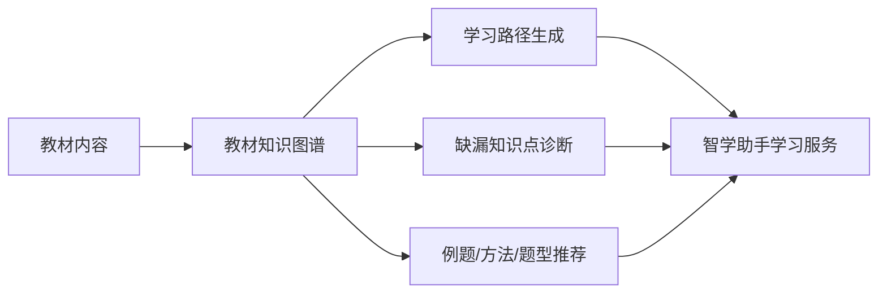
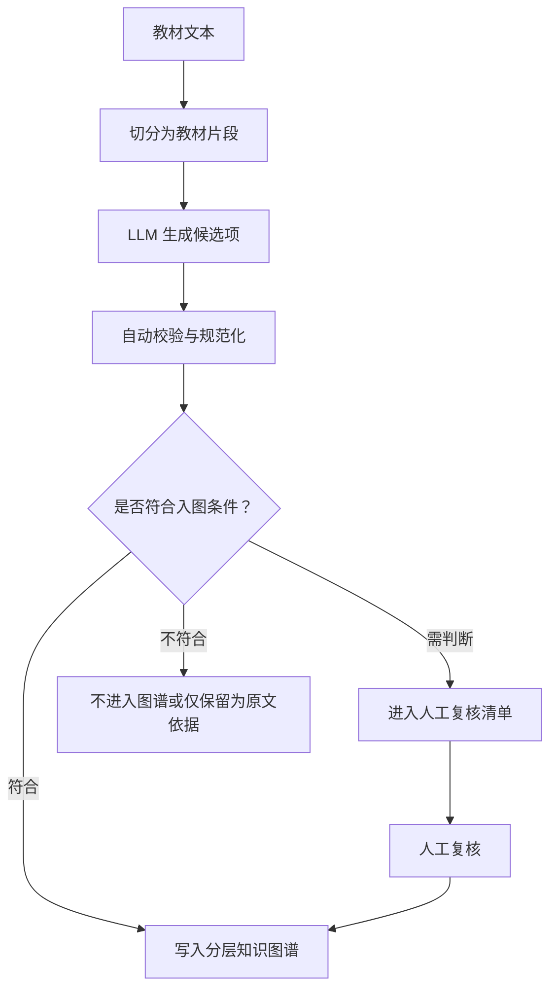
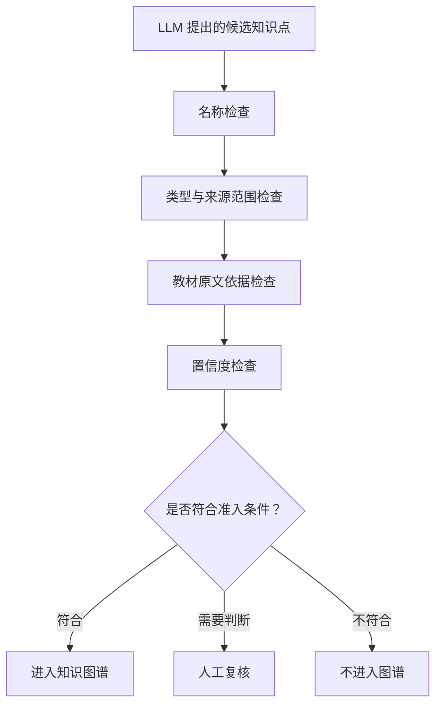
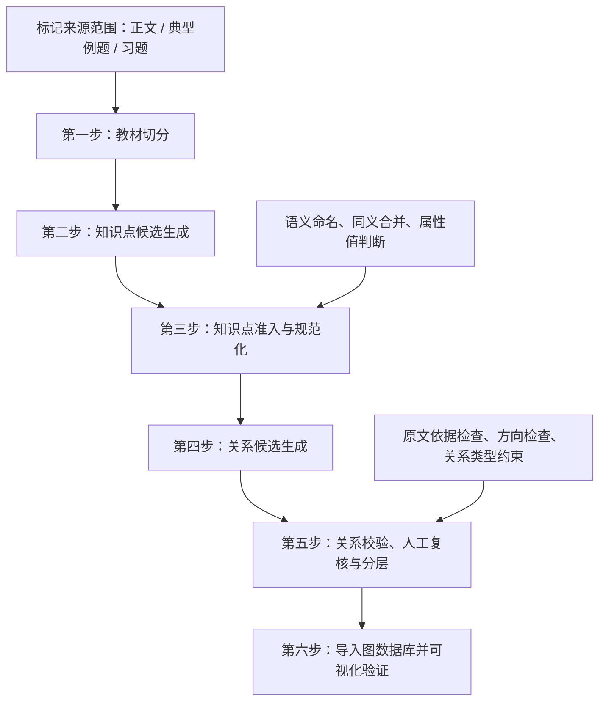
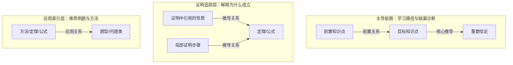
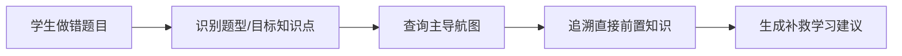
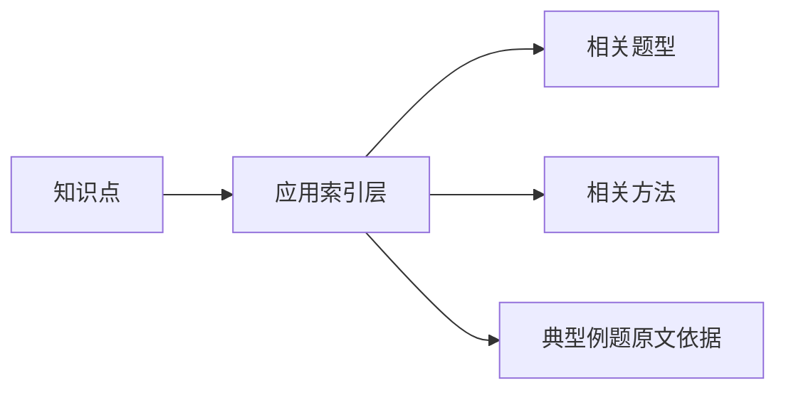

# 智学助手教材知识图谱设计说明（交流稿）

> 这份材料主要用于和老师交流“智学助手”项目中教材知识图谱的设计思路。当前方案处于 v4.1 验证阶段，已基于《高等代数》教材的局部章节完成初步工程验证，并导入 Neo4j 进行可视化检查。材料中重点整理了目前的建设定位、抽取流程、关键规则、应用场景，以及我希望请老师帮忙把关的几个问题；具体实验数量统计暂不放入正文，可作为内部实验记录另行整理。

## 一、项目背景与建设定位

智学助手中的教材知识图谱，定位并非展示型知识网络，而是面向智能学习服务的底层结构化支撑。其核心任务是把教材中的概念、定义、定理、公式、方法、题型及其相互关系组织成可计算、可追溯、可用于教学决策的数据结构。

从应用目标看，本知识图谱主要服务以下三类场景：

1. 学生在解题受阻时，追溯可能缺失的前置知识点。
2. 根据教材章节顺序和知识依赖关系，生成学习路径或复习路径。
3. 围绕某一知识点推荐相关例题、解题方法和题型。

因此，目前设计时关注的重点不是尽可能生成更多关系，而是使不同用途的关系具有清晰的层次和边界。学习路径所需的前置关系、定理证明中的推导关系、例题中的应用关系，在教学作用和使用场景上并不相同；若混合处理，可能导致路径生成过密、诊断依据不清、推荐结果难以解释。



## 二、总体设计思路

目前采用“LLM 辅助生成候选项，自动校验程序进行质量控制，人工复核处理不确定样本”的总体路线。这样设计主要基于以下考虑：

- 仅依靠规则抽取，难以覆盖数学教材中较为复杂的自然语言表达、隐含命名和跨句推导。
- 完全依赖 LLM 直接生成最终图谱，则可能出现过度推断、关系方向错误、例题结论误抽、知识点粒度漂移等问题。
- 因此，LLM 更适合承担“发现候选内容”的任务；最终是否进入知识图谱，需要经过命名规范、来源范围、教材原文依据、关系方向、关系分层等多重约束。

在这个思路下，LLM 的输出不直接写入最终图数据库，而是先形成候选知识点和候选关系。自动校验程序对候选项进行准入检查；确定性较高且符合规则的内容进入图谱，不确定内容进入人工复核清单，明显不符合规则的内容不进入图谱。



## 三、工程落地方式：候选生成与准入控制

在工程实现上，目前并不把“抽取”理解为一次性生成最终结果，而是拆分为“候选生成”和“准入控制”两个阶段。

### 1. 候选生成

LLM 按统一提示要求阅读教材片段，提出可能具有图谱价值的知识点或关系。每个候选知识点通常包含以下信息：

| 信息项 | 含义 |
|---|---|
| 候选名称 | 尽量使用学生可理解、可检索的语义名称 |
| 候选类型 | 判断其属于概念、定义、定理、公式、方法、题型、属性值，或仅适合作为原文依据 |
| 候选角色 | 判断其是否可能成为正式知识点，还是只作为属性值、方法候选、题型候选或原文依据 |
| 教材原文依据 | 给出能够回到教材的连续原文片段 |
| 置信度 | 表示 LLM 对该候选项稳定性的判断 |
| 别名与来源标签 | 保存“定理1”“公式2”等教材编号，但不把编号作为知识点名称 |

示意如下：

```text
候选名称：对换改变 n 元排列的奇偶性
候选类型：定理
候选角色：正式知识点
教材原文依据：教材中对应的定理表述
别名/来源标签：定理1
置信度：较高
```

这一阶段强调“充分提出可能项”，但不意味着全部候选项都会进入最终图谱。

### 2. 准入控制

自动校验程序对候选项进行多方面检查，主要包括：

1. 名称检查：编号定理、编号公式不能直接以“定理1”“公式2”等形式作为知识点名称。
2. 类型检查：知识点类型必须属于预设范围，且与教材来源范围相匹配。
3. 来源范围检查：正文可产生正式知识点；典型例题主要产生方法、题型或应用原文依据；习题在当前阶段暂不参与抽取。
4. 教材原文依据检查：候选项应能回溯到教材片段中的原文表述。
5. 置信度检查：低置信度候选项不进入图谱；中等置信度候选项进入人工复核；高置信度且无其他问题的候选项可自动准入。
6. 同义合并检查：目前只自动合并“名称相同且类型相同”的知识点；疑似同义、上下位或粒度重叠的情况进入人工复核。
7. 属性值检查：“唯一解”“无解”“零解”等默认作为属性值处理，只有满足特定条件时才升级为独立知识点。



## 四、抽取流程设计

当前 v4.1 流程分为六个步骤。



### 第一步：教材切分

将结构化教材文本切分为相对独立的教材片段，并标记其来源范围：

- 正文内容：用于抽取正式知识点及其核心关系。
- 典型例题：主要用于抽取方法、题型和应用原文依据。
- 习题：当前阶段暂不参与抽取，以降低题干噪声对知识点抽取的影响。

### 第二步：知识点候选生成

由 LLM 从教材片段中提出候选知识点。候选类型包括：

- 概念
- 定义
- 定理
- 公式
- 方法
- 题型
- 属性值
- 仅作为原文依据的内容

其中，典型例题的处理范围受到严格限制：典型例题可以产生“方法”和“题型”类候选，但不允许把例题中的具体结论抽取为正式定理、公式、定义或概念。

### 第三步：知识点准入与规范化

该步骤对候选知识点进行准入判断与规范化处理，主要包括：

- 语义命名：编号只是教材来源标签，不能作为知识点名称；若教材只有编号而无通用名称，则需生成学生可理解、可检索的语义名称。
- 同义合并：当前阶段采用保守合并策略，避免因自动合并过度造成知识点边界混乱。
- 属性值判断：默认将“唯一解”“无解”“零解”等状态作为属性值；只有在教材单独定义、有独立判别准则、参与多重关系或后文专题展开时，才升级为独立知识点。
- 人工复核：对命名不稳定、来源依据不足、粒度边界不清或类型判断不确定的候选项进行人工复核。

### 第四步：关系候选生成

关系候选只在已准入的知识点之间生成，避免 LLM 自行创造关系两端的知识点。主要关系类型包括：

- 前置关系：A 是理解 B 的直接必要前置。
- 推导关系：B 由 A 推出、证明、特化或改写得到。
- 应用关系：A 可用于解决或处理 B。

关系方向采用统一约定：若 A 指向 B，则表示 A 对 B 具有前置、推导来源或应用支撑作用，而不是简单表示教材中的出现顺序。

### 第五步：关系校验、人工复核与分层

关系候选生成后，需要进一步检查：

- 关系两端是否均来自已准入知识点。
- 关系方向是否符合预设定义。
- 教材原文依据是否能够支持该关系。
- 前置关系是否满足“直接必要”的强标准。
- 典型例题相关关系是否仅进入应用索引层。
- 不确定关系是否应提交人工复核。

### 第六步：导入图数据库并可视化验证

通过脚本将通过准入的知识点和关系导入 Neo4j。默认视图以“主导航图”为主，其余层可按需要单独导入和查看，以避免证明细节或例题应用关系干扰学习路径生成。

## 五、关键设计规则

### 1. 定理与公式的语义命名

数学教材中的定理、命题、推论、公式往往以编号形式出现，如“定理1”“命题2”“公式3”。此类编号具有来源定位作用，但不适合作为知识图谱中的正式名称。正式名称应尽量反映其数学内容，便于学生理解、检索和复习。

处理原则如下：

- 若教材中已有通用名称，则采用通用名称。
- 若教材中只有编号但内容重要，则生成语义名称。
- 编号保留为别名或来源标签，用于回溯教材位置。

| 教材呈现 | 图谱命名 |
|---|---|
| 定理1：任意矩阵可经初等行变换化为阶梯形矩阵 | 矩阵可化为阶梯形 |
| 定理5：单调有界数列必收敛 | 单调有界收敛准则 |
| 牛顿-莱布尼茨公式 | 牛顿-莱布尼茨公式 |

### 2. 属性值与独立知识点的边界

“唯一解”“无解”“无穷多个解”等状态类表达，默认不单独抽取为概念知识点，而是优先作为某一对象的属性值。例如，线性方程组可以具有“有唯一解”“无解”“有无穷多个解”等状态。

但若满足以下条件之一，可考虑升级为独立知识点：

| 升级条件 | 示例 |
|---|---|
| 教材对该状态单独给出定义 | 齐次线性方程组的零解 |
| 具有独立判别准则 | 无解等价于增广矩阵秩大于系数矩阵秩 |
| 参与多个关系 | 作为多个定理或方法之间的桥接知识点 |
| 后文以该状态为主题展开 | 整节讨论某类解的结构 |

该规则的目的，是避免把大量状态词误抽为概念，同时保留确有教学意义和关系连接价值的状态类知识。

### 3. 典型例题的处理

早期方案曾完全跳过典型例题，以降低“例题答案被误抽为定理”的风险。但智学助手需要支持按知识点推荐例题、方法和题型，因此 v4.1 对典型例题采用有限抽取策略：

- 典型例题不产生正式概念、定义、定理、公式。
- 典型例题可以产生方法和题型。
- 典型例题产生的关系只进入应用索引层，不进入学习路径主图。
- 典型例题中抽出的通用方法，原则上先进入人工复核，再决定是否入图。

该策略试图在“降低噪声”和“保留应用价值”之间取得平衡。

### 4. 三层关系结构

为适配不同教学应用，目前将关系分为三层：

| 中文名称 | 系统内部代号 | 主要用途 | 主要关系 |
|---|---|---|---|
| 主导航图 | `main` | 学习路径生成、缺漏知识诊断 | 强前置关系，少量核心推导关系 |
| 证明追踪层 | `proof_trace` | 解释定理或公式的证明来源 | 局部证明依赖、推导链 |
| 应用索引层 | `application_index` | 推荐例题、方法和题型 | 应用关系 |



主导航图采用相对严格的准入标准，以保证学习路径可读、可解释；证明追踪层用于保留局部推导信息；应用索引层用于支撑例题、方法和题型推荐。三层之间既相互关联，又在用途上保持区分。

### 5. 前置关系采用强标准

前置关系仅表示“理解目标知识点所必需的直接前置知识”。以下情况不自动构成前置关系：

- A 仅在教材中早于 B 出现。
- A 与 B 在同一节中并列出现。
- A 只是 B 的证明中使用过的工具。
- A 与 B 主题相关，但不是理解 B 的必要条件。

若上述关系具有保留价值，可优先放入证明追踪层或应用索引层，而不直接进入主导航图。该设计旨在避免学习路径过密，保证路径推荐和缺漏诊断的解释性。

## 六、当前验证情况与需要注意的问题

当前已基于《高等代数》教材的局部章节进行初步验证，并导入本地 Neo4j 进行可视化检查。正文中暂不列出具体数量统计；如老师需要，可另行提供内部实验记录。

目前已经重点检查了以下方面：

- 是否能够区分教材正文、典型例题和习题，并采用不同抽取策略。
- 是否能够将“定理1”“公式2”等编号保留为来源标签，而非作为正式知识点名称。
- 是否能够分别查看主导航图、证明追踪层和应用索引层。
- 是否能够利用主导航图观察学习路径和前置知识。
- 是否能够在应用索引层中查看知识点、方法和题型之间的关联。
- 是否能够将不确定样本提交人工复核，减少自动抽取结果中的不稳定项。

当前仍有一些地方需要继续讨论和完善：

- 同义合并策略较为保守，疑似同义、上下位和粒度重叠问题仍依赖人工复核。
- 典型例题中的方法和题型具有应用价值，但也存在误抽风险，需要进一步完善准入标准。
- 证明追踪层可能出现粒度偏细的问题，需要进一步判断哪些证明依赖具有保留价值。
- 应用索引层需要在更多章节上验证覆盖度和稳定性。
- 主导航图采用强前置标准，有利于保持路径简明，但也可能遗漏部分弱关联知识。

## 七、应用场域

### 1. 知识缺漏诊断

当学生在某道题上出现困难时，系统可先识别题目涉及的目标知识点或题型，再沿主导航图反向追溯必要前置知识，从而辅助判断学生可能缺失的知识环节。



### 2. 学习路径生成

系统可结合教材章节顺序和主导航图中的前置关系，为某一章节、某一知识点或某一学习目标生成学习路径。主导航图采用较严格标准，适合作为默认路径骨架。

### 3. 例题、方法和题型推荐

应用索引层可支持以下问题：

- 学习某一知识点后，适合练习哪些题型？
- 某类题型通常使用哪些方法？
- 某一定理或公式在教材例题中如何被应用？



### 4. 证明解释

证明追踪层用于解释定理、公式或重要结论的来源，可辅助回答：

- 该定理由哪些已有结论推出？
- 证明过程中依赖了哪些性质、公式或方法？
- 某个公式在教材中如何得到？

## 八、想请老师重点帮忙看的问题

这份材料最想请老师帮忙看的，是教材知识图谱的抽取规则是否合理、边界是否清楚、后续是否适合继续扩大到更多章节。下面的问题列得比较细，老师可以先挑重点看，后面也方便线下讨论。

### 1. 关于知识点抽取粒度

1. 当前把概念、定义、定理、公式、方法、题型都作为可能的知识点类型，这个范围是否合适？
2. 编号定理不直接命名为“定理1”，而是生成语义名称，同时保留编号作为来源标签，这样处理是否合理？
3. 对于教材中没有通用名称、但内容比较重要的定理或结论，是否应该抽取为知识点？如果抽取，语义命名应遵循什么原则？
4. 当前知识点粒度是否可能过细？哪些内容更适合作为教材原文依据，而不应成为独立知识点？

### 2. 关于属性值与独立知识点边界

1. “唯一解”“无解”“零解”等状态默认作为属性值，而不是直接抽为概念知识点，这个判断是否合理？
2. 如果某个状态在教材中有单独定义、判别准则、后续专题讨论，才升级为独立知识点，这个升级条件是否还需要补充或收紧？
3. 在线性代数/高等代数教材中，是否还有类似“属性值容易被误抽为概念”的典型情况需要提前规定？

### 3. 关于关系类型与分层

1. 将关系分为主导航图、证明追踪层、应用索引层三层，这样是否有助于区分学习路径、证明解释和例题推荐？
2. 主导航图只保留较强的前置关系，是否会过于保守？如果用于学生学习路径生成，哪些弱关联也应该保留？
3. 证明中用到的工具性结论，应该放入证明追踪层，还是也应进入主导航图？
4. 推导关系 `A -> B` 表示“B 由 A 推出”，这个方向约定是否符合老师对数学知识关系的理解？
5. 典型例题只进入应用索引层，不进入主导航图，这样是否会丢失重要的学习线索？

### 4. 关于后续扩展与评价

1. 如果继续扩展到更多章节，应优先检查哪些问题：知识点粒度、关系方向、前置关系标准，还是例题方法抽取？
2. 后续评价应如何设计？例如抽取结果的人工标注一致性、学习路径可用性、诊断准确率、例题推荐命中率等，哪些指标更值得优先做？
3. 如果后续扩展到多本教材，是否应先分别构建单本教材图谱，再进行跨教材统一归并？

## 九、后续计划

下一步计划先根据老师的建议，集中修改知识点粒度、属性值边界、关系分层和人工复核规则。规则相对稳定后，再扩展到更多章节，并继续观察主导航图、证明追踪层和应用索引层是否能分别支撑学习路径、证明解释和例题推荐。
