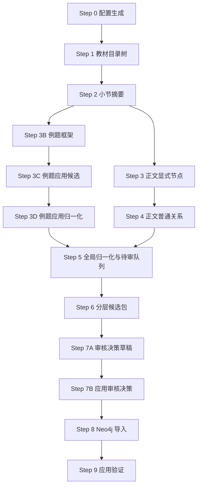

# v4.4 Step 说明

本文档用于说明 v4.4 工作区的真实执行流程。这里特意区分两个词：

- `step-text`：交流稿、方案文档、提示词中的解释性步骤，用来帮助人理解设计思想。
- `正式 Step`：本目录中可以运行的脚本步骤，以文件名前缀为准，例如 `03_extract_explicit_nodes.py`。

后续讨论“现在到 Step 几”时，以正式 Step 为准。

## 一、v4.4 的核心变化

v4.4 继承 v4.3 的主体流程：先构建教材目录树，再按小节生成摘要、节点、关系，最后归一化、审核、入库。v4.4 的新增重点是把“知识组”正式纳入最终图谱，解决节点过细后在 Neo4j 中呈现为大量散点的问题。

与 v4.2 的关键区别仍然保留：条件判断不再被压成一条普通边，也不再把“无解、唯一解、无穷多解”等状态轻易升级为核心概念。条件判断进入专门的规则案例层：

```text
核心定理/公式/方法
  --HAS_RULE_CASE-->
规则案例 RuleCase
  --APPLIES_TO-->
适用对象
  --HAS_CONDITION-->
条件表达式 ConditionExpression
  --HAS_OUTCOME-->
结论/状态 Outcome
```

示例：

```text
线性方程组解的判定定理 --HAS_RULE_CASE--> 无解判定
无解判定 --APPLIES_TO--> 非齐次线性方程组
无解判定 --HAS_CONDITION--> r(A)<r(A|b)
无解判定 --HAS_OUTCOME--> 线性方程组无解
```

这样做的原因是：条件判断本质上是“在某条件下得到某结论”的规则，不宜直接写成 `线性方程组 --某状态关系--> 无解`。直接连边虽然直观，但会丢掉条件，也容易让图谱误以为该状态无条件成立。

v4.4 进一步增加三项设计：

- 所有最终节点、边、规则案例保留 `source_code`，作为紧凑来源编码，例如 `gaodai_shang:C03:S05:U01`。教材来源是元数据，不默认建成可见的教材结构节点。
- Step 7B 自动生成确定性 `KnowledgeGroup`，包括按小节生成的 `SectionGroup` 和按规则案例所属节点生成的 `RuleGroup`。这些组不由 LLM 自由发明。
- Step 8 展开规则案例时，为条件表达式和结论节点生成保守的 `REFERS_TO` 边，使“系数矩阵的秩等于 n”这类条件能回连到 `系数矩阵`、`矩阵的秩` 等核心知识点。

## 二、正式 Step 总览



## 三、各正式 Step 的职责

### Step 0：配置生成

脚本：`00_prepare_config.py`

生成 `v4_3_config.json`，记录输入教材、输出目录、节点类型、边类型、LLM 配置和 Tree-KG API 适配信息。

当前清华 Tree-KG 公共接口在本地探测中返回过 403，因此 v4.3 把它作为“可选适配器”，默认仍走本地 DeepSeek 调用。

### Step 1：教材目录树

脚本：`01_build_textbook_tree.py`

读取结构化 Markdown，识别章、节、小节、锚点，区分内容精华、典型例题和习题。

习题默认不进入抽取；典型例题不进入正文核心节点抽取，但进入例题应用层。

### Step 2：小节摘要

脚本：`02_generate_section_summaries.py`

按小节生成摘要线索，包括：

- 定义线索
- 定理/公式线索
- 方法/题型线索
- 属性/状态线索
- 条件判断线索 `rule_case_hints`

`rule_case_hints` 只做导航，不是最终节点或边。它服务 Step 3 生成规则案例字段。

### Step 3：正文显式节点

脚本：`03_extract_explicit_nodes.py`

从内容精华小节抽取核心节点候选：

- `Concept`
- `Method`
- `Formula`
- `Theorem`
- `ProblemClass`

定义不作为独立节点，写入相关节点的 `definition` 字段。

属性值不作为独立节点，默认进入 `attributes` 或 `state_notes`。如果原文给出条件判断、充要条件、判别准则或分情况结论，写入所属 `Theorem`、`Formula` 或 `Method` 的 `rule_cases` 字段。

### Step 3B：例题框架

脚本：`03b_extract_example_frames.py`

只处理典型例题，输出 `ExampleFrame`，包括题型、方法、使用工具、得到结果等证据。

它不直接产正式 KG 节点和边。

### Step 3C：例题应用候选

脚本：`03c_convert_example_frames.py`

把 `ExampleFrame` 转成应用层候选：

- 例题中可复用的方法 `Method`
- 可复用题型 `ProblemClass`
- 应用关系 `USES` / `GETS`

这些候选默认需要审核，不直接进入核心主图。

### Step 3D：例题应用归一化

脚本：`03d_normalize_example_applications.py`

对例题应用候选做名称归一、核心节点匹配、重复合并。

推荐使用 `--clean-flow` 保留可疑候选进入 Step 5/7 审核，不在 Step 3D 提前删除或改写。

### Step 4：正文普通关系

脚本：`04_extract_explicit_edges.py`

只在已准入节点池内抽取普通显式关系：

- `SUPERIOR`：下位到上位
- `EQUATIVE`：同位、并列、同类
- `PART_OF`：部分到整体
- `HAS_PROPERTY`：对象到性质/准则/关于该对象的结论性命题
- `USES`：使用者到被使用工具
- `GETS`：方法/公式/定理得到结果
- `DERIVES`：推导依据到被推出结论

Step 4 禁止输出条件判断关系，禁止输出 `HAS_CONDITION`、`HAS_OUTCOME`、`HAS_RULE_CASE`，也禁止旧关系名 `DERIVED_FROM`。

v4.4 可选使用 `--semantic-augment` 生成保守的语义归属候选。该增强只基于当前小节节点、前序可见节点、小节标题和教材原文证据，不调用外部知识，也不新增节点。增强候选会标记 `semantic_inferred=true` 和 `basis_type`，例如：

```text
n阶行列式 --HAS_PROPERTY--> 两行互换反号性质
化为上三角形行列式方法 --USES--> n阶行列式
```

这类边用于补强“对象-性质”“方法-对象/工具”的核心语义关系。若证据或端点涉及待审节点，则仍进入 review，不直接越过审核。

### Step 5：全局归一化与待审队列

脚本：`05_global_normalize_and_review.py`

把正文节点、正文边、例题应用候选合并成统一候选包，并分出：

- 自动进入主候选的核心节点/边
- 待审节点
- 待审普通边
- 待审规则案例
- 拒绝归档项

规则案例默认进入待审，因为它涉及条件、结论、适用对象三者是否对应，风险比普通属性更高。

### Step 6：分层候选包

脚本：`06_build_layered_candidates.py`

把 Step 5 结果整理成阶段一分层包：

- `explicit_core`
- `example_application`
- `rule_case`
- `review_pending`
- `rejected_archive`

这一层仍不做最终人工决策，也不写 Neo4j。

### Step 7A：审核决策草稿

脚本：`07_prepare_review_preapproval.py`

读取 Step 6 待审项，生成结构化决策草稿：

- 节点决策
- 普通边决策
- 条件判断规则案例决策

默认策略是保守暂缓：未明确接受的项目不会进入最终包。

可用决策：

- `accept`：接受进入最终包
- `rewrite`：改写后进入最终包，原件进归档
- `reject`：拒绝，原件进归档
- `defer`：暂缓，进入最终待审文件

### Step 7B：应用审核决策

脚本：`07b_apply_review_decisions.py`

把 Step 7A 的决策真正落盘，生成：

- `final_core_nodes.jsonl`
- `final_core_edges.jsonl`
- `final_application_nodes.jsonl`
- `final_application_edges.jsonl`
- `final_rule_cases.jsonl`
- `final_knowledge_groups.jsonl`
- `final_knowledge_group_edges.jsonl`
- `final_archived_items.jsonl`
- `final_review_pending.jsonl`
- `decision_trace.jsonl`

注意：节点里的 `rule_cases` 字段在 Step 7B 会清空。只有 `final_rule_cases.jsonl` 中通过审核的规则案例，Step 8 才会展开入库。这样可以避免“规则案例被拒绝，但仍藏在节点字段里导入”的问题。

v4.4 对普通边增加两条落盘守卫：

- 接受或改写后的边，必须保证源节点和目标节点都已经进入最终节点包；否则该边进入 `final_review_pending.jsonl`，不会写入最终边文件。
- 普通边按“源端点 + 目标端点 + 关系类型 + 图层”的语义键去重，而不是按候选阶段的 `edge_id` 去重。这样同一条数学关系即使来自 LLM 候选、语义增强或审核改写，也不会重复导入。

v4.4 在 Step 7B 额外自动生成知识组：

- `SectionGroup`：按 `section_node_id` 自动生成，一个小节一个组。该组通过 `HAS_MEMBER` 指向本小节通过审核的核心知识点。
- `RuleGroup`：按规则案例的 `owner_node_id` 自动生成，一个拥有规则案例的定理、公式或方法对应一个规则组。该组通过 `HAS_ANCHOR` 指向所属核心节点，并通过 `HAS_MEMBER` 指向它的规则案例。
- `TopicGroup`、`MethodGroup` 暂不自动生成。未来如果需要主题组或方法组，应由 LLM 提议、进入审核队列，再由人工或高智力审核脚本确认。

### Step 8：Neo4j 导入

脚本：`08_import_neo4j.py`

读取 Step 7B 最终包。核心节点/边和应用层节点/边直接导入；规则案例先展开为规则层节点和边，再导入 Neo4j。

v4.4 同时导入 `KnowledgeGroup` 与知识组关系。知识组关系是导航关系，不等同于数学语义关系。

规则案例展开时会生成：

- `RuleCase`
- `ConditionExpression`
- `Outcome`
- `HAS_RULE_CASE`
- `APPLIES_TO`
- `HAS_CONDITION` / `HAS_CONDITION_AND`
- `HAS_OUTCOME`
- `REFERS_TO`

其中 `REFERS_TO` 用于表达“条件表达式或结论文本中提到了某个核心知识点”。例如：

```text
有解判定 --HAS_CONDITION--> 系数矩阵与增广矩阵的秩相等
系数矩阵与增广矩阵的秩相等 --REFERS_TO--> 系数矩阵
系数矩阵与增广矩阵的秩相等 --REFERS_TO--> 增广矩阵
系数矩阵与增广矩阵的秩相等 --REFERS_TO--> 矩阵的秩
```

如果规则案例缺少所属节点、条件、结论或证据，Step 8 会产生 warning。执行导入时若存在 warning，会拒绝入库。

### Step 9：应用验证

脚本：`09_application_validation.py`

连接 Step 8 已导入的 Neo4j 图谱，使用一组面向智学助手真实场景的验收问题进行验证。当前默认测试覆盖：

- 核心知识点是否能查到；
- 学生不会某知识点时，是否能找到相关支撑知识；
- 给定知识点时，是否能推荐相关方法、公式或性质；
- 两个知识点之间是否存在可解释路径；
- 条件判断类问题是否能从规则案例层返回适用对象、条件、结论和证据。

Step 9 只读 Neo4j，不修改图谱。它的产物是应用验证报告和原始查询结果，用来判断当前图谱是否能服务学习路径、知识追溯、方法推荐和条件判断问答。如果测试失败或只部分通过，应回到抽取规则、关系定义、审核策略或导入展开逻辑中修正，而不是在 Step 9 直接补边。

v4.4 的 Step 9 必须同时报告两个口径：

- 结构孤立节点：把所有边都算进去，包括 `HAS_MEMBER`、`HAS_ANCHOR`。
- 语义孤立节点：忽略知识组边，只看数学语义关系和规则层关系。

原因是知识组会让图谱在结构上更连通，但不能替代核心数学语义边。应用验证时必须区分“便于导航”和“语义关系充分”。

## 四、关系类型分层

### 教材结构层

```text
HAS_SUBSECTION
INTRODUCES
HAS_EXAMPLE
```

### 核心普通关系层

```text
SUPERIOR
EQUATIVE
PART_OF
HAS_PROPERTY
USES
GETS
DERIVES
```

### 条件判断规则层

```text
HAS_RULE_CASE
APPLIES_TO
HAS_CONDITION
HAS_CONDITION_AND
HAS_CONDITION_OR
HAS_OUTCOME
HAS_OUTCOME_AND
HAS_OUTCOME_OR
REFERS_TO
```

### 知识组导航层

```text
HAS_MEMBER
HAS_ANCHOR
RELATES_TO_GROUP
```

当前已实现 `HAS_MEMBER` 和 `HAS_ANCHOR`。`RELATES_TO_GROUP` 是预留关系，用于未来表达核心节点与主题组、方法组之间的导航连接。

### 派生/展示层

```text
PREREQUISITE_OF
HAS_POSSIBLE_STATE
```

这两类不由 Step 4 直接抽取，可在后续应用验证或图查询展示中从核心图与规则层推导。

## 五、条件判断的处理口径

遇到下列表达时，优先进入规则案例层：

- 若 A，则 B
- 当 A 时，B
- A 当且仅当 B
- A 的充要条件是 B
- 分情况讨论，每种情况有明确结论

不推荐：

```text
线性方程组 --状态关系--> 无解
条件表达式 --DERIVES--> 无解
线性方程组 --GETS--> 无解
```

推荐：

```text
判定定理 --HAS_RULE_CASE--> 无解判定
无解判定 --APPLIES_TO--> 线性方程组
无解判定 --HAS_CONDITION--> 秩条件
无解判定 --HAS_OUTCOME--> 无解
```

如果应用端需要快速查询“线性方程组可能有哪些状态”，可以在展示层派生：

```text
线性方程组 --HAS_POSSIBLE_STATE--> 无解
```

但这条边必须标明是派生/展示边，不替代规则层的条件结构。

## 六、知识组的处理口径

知识组的目标不是替代概念、定理、公式、方法之间的数学关系，而是提供一个中间层，让应用端可以把同一小节、同一规则主题或同一方法族中的细粒度节点组织起来。

当前实现只允许两类确定性知识组：

- `SectionGroup`：由教材小节自动生成，组名采用小节名，来源编码来自 `section_node_id`。
- `RuleGroup`：由已通过审核的规则案例自动生成，组名采用“所属知识点 + 规则组”。

暂不允许 LLM 直接生成自由知识组，原因是自由主题组容易把“教材位置相近”“概念语义相近”“解题方法相近”混在一起，导致组边含义不清。后续如果引入 `TopicGroup` 或 `MethodGroup`，必须进入审核环节，并明确组的创建依据。

## 七、来源编码原则

`source_code` 是紧凑来源字段，不是默认图谱节点。建议格式：

```text
教材ID:章:节:小节
教材ID:章:节:小节:段
教材ID:章:节:小节:句
```

当前脚本主要使用到小节级，例如：

```text
gaodai_shang:C03:S05:U01
```

这样做的好处是：Neo4j 中的知识图谱仍以数学知识为主，不被教材目录节点淹没；但每个节点和边仍能追溯到教材来源。

## 八、审核产物原则

v4.4 明确要求：被拒绝、改写或暂缓的内容不能无痕消失。

- 拒绝项进入 `final_archived_items.jsonl`
- 暂缓项进入 `final_review_pending.jsonl`
- 改写项保留原件，并把改写结果写入最终包
- 所有动作进入 `decision_trace.jsonl`

这保证后续可以追溯：某个候选为什么没进图，是被拒绝、被改写，还是仍待审。
