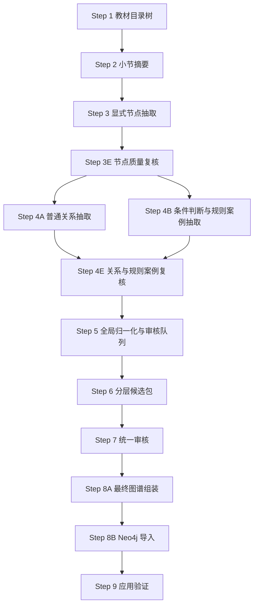
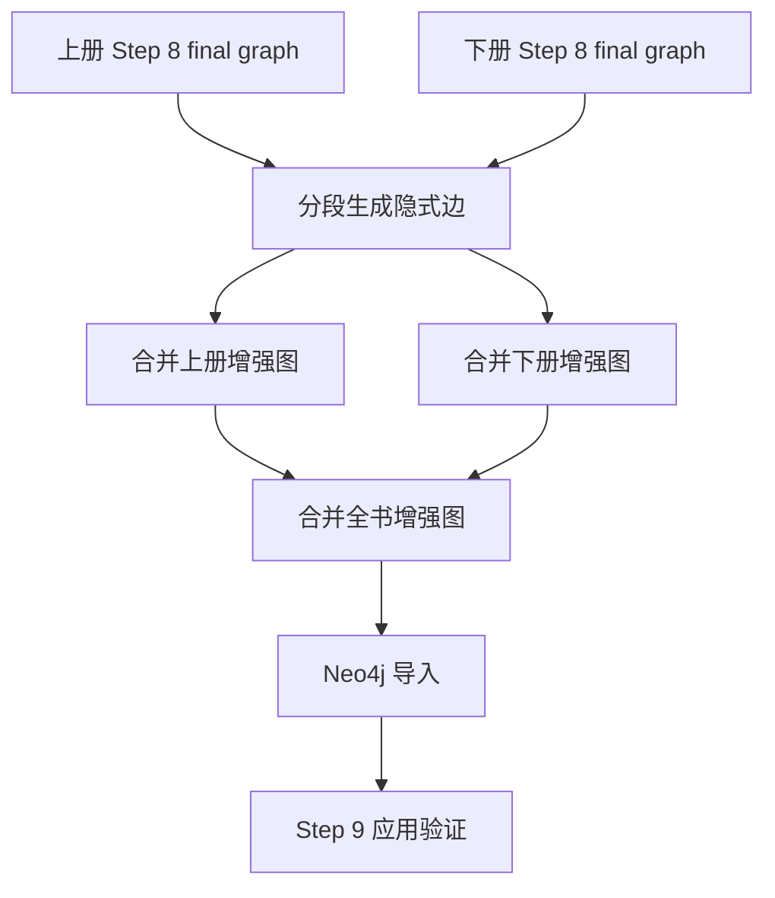

# 高数提取工作区 README

更新时间：2026-06-27

本目录是“智学助手”项目中高等数学教材知识图谱的本地工作区，包含高数上册、下册的 v4.4 抽取脚本、正式中间产物、隐式边增强产物、Neo4j 导入报告和应用验证报告。

## 当前推荐使用的最终产物

当前上线前推荐版本是：

```text
D:\ai-math\教材提取模块\高数提取\隐式边_runs\gaoshu_full_step8_with_implicit_top30_20260626
```

对应 Neo4j import batch：

```text
gaoshu_full_with_implicit_top30_20260626
```

这个版本是在上下册 v4.4 显式图谱基础上，追加 top30 隐式边增强后得到的全书合并图谱。

核心统计：

| 项目 | 数量 |
|---|---:|
| 核心节点 | 1387 |
| 核心边 | 901 |
| RuleCase | 772 |
| KnowledgeGroup | 894 |
| Neo4j 展开导入节点 | 5688 |
| Neo4j 展开导入边 | 8813 |
| 隐式边 | 117 |
| 导入 warnings | 0 |
| skipped edges | 0 |

Step 9 应用验证：

| 测试范围 | 结果 |
|---|---:|
| 上册 C01-C06 | 15 / 15 pass |
| 下册 C07-C12 | 29 / 29 pass |
| 结构孤立节点 | 0 |
| 忽略知识组边后的核心语义孤立节点 | 187 |

关键报告位置：

```text
隐式边_runs\gaoshu_full_step8_with_implicit_top30_20260626\final_assembly_report.md
隐式边_runs\gaoshu_full_step8_with_implicit_top30_20260626\neo4j_import_report.md
隐式边_runs\gaoshu_full_step8_with_implicit_top30_20260626\step9_application_validation_c01_c06\step9_application_validation_report.md
隐式边_runs\gaoshu_full_step8_with_implicit_top30_20260626\step9_application_validation_c07_c12\step9_application_validation_report.md
```

## 目录说明

```text
高数提取
├─ v4.4
│  ├─ 高数上册正式脚本
│  ├─ 中间产物
│  ├─ 真实场景抽检测试_c01_c06.json
│  └─ v4.4_step说明.md
├─ v4.4_xia
│  ├─ 高数下册正式脚本
│  ├─ 中间产物
│  ├─ 正式_runs
│  ├─ 真实场景抽检测试_c07_c12.json
│  └─ .env
├─ 11_generate_implicit_edges.py
├─ 11_merge_implicit_edges.py
├─ 12_merge_final_graphs.py
├─ .env.example
└─ 隐式边_runs
   ├─ gaoshu_full_step8_with_implicit_top30_20260626
   ├─ gaoshu_shang_step8_with_implicit_top30_20260626
   ├─ gaoshu_xia_step8_with_implicit_top30_20260626
   └─ 其他实验或历史 run
```

说明：

- `v4.4` 是上册工作区。
- `v4.4_xia` 是下册工作区。
- `隐式边_runs` 存放隐式边生成、合并、导入、Step 9 验证产物。
- `11_generate_implicit_edges.py` 是当前使用的隐式边候选生成与 LLM 判边脚本。
- `12_merge_final_graphs.py` 是当前使用的最终图谱合并脚本。
- `11_merge_implicit_edges.py` 是较早的隐式边合并辅助脚本，当前推荐用 `12_merge_final_graphs.py`。

## v4.4 正式抽取流程

正式流程以脚本编号为准。完整说明见：

```text
v4.4\v4.4_step说明.md
v4.4_xia\v4.4_step说明.md
```

核心逻辑：



本轮高数上下册在 Step 8 后额外执行了“隐式边增强”：



## 环境变量

真实密钥只放本地 `.env`，不要写入 README 或对外材料。示例文件见：

```text
.env.example
```

隐式边脚本读取环境变量的默认顺序：

1. 命令行 `--env-file`
2. 当前进程环境变量
3. `高数提取\.env`
4. `高数提取\v4.4_xia\.env`
5. `高数提取\v4.4\.env`
6. `D:\ai-math\教材提取模块\.env`

当前兼容网关存在证书主机名不匹配问题，因此本地 `.env` 使用：

```text
LLM_VERIFY_SSL=false
```

这只影响 Python requests 的 HTTPS 证书校验，不改变图谱抽取规则。

## 常用命令

### 1. 生成隐式边

以下命令会利用 checkpoint。相同 out-dir 重新运行时，已完成候选会跳过。

```powershell
python "D:\ai-math\教材提取模块\高数提取\11_generate_implicit_edges.py" `
  --final-dir "D:\ai-math\教材提取模块\高数提取\v4.4\中间产物\c01_c06_cumulative\step8_final_graph" `
  --out-dir "D:\ai-math\教材提取模块\高数提取\隐式边_runs\shang_c01_c03_implicit_min_20260626" `
  --config "D:\ai-math\教材提取模块\高数提取\v4.4\v4_4_gaoshu_config.json" `
  --env-file "D:\ai-math\教材提取模块\高数提取\v4.4_xia\.env" `
  --max-candidates 30 `
  --batch-size 1 `
  --workers 1 `
  --chapter-regex "第1章|第2章|第3章" `
  --min-confidence 0.72 `
  --timeout 60 `
  --max-tokens 600
```

四个正式分段：

| 分段 | out-dir |
|---|---|
| 上册 C01-C03 | `隐式边_runs\shang_c01_c03_implicit_min_20260626` |
| 上册 C04-C06 | `隐式边_runs\shang_c04_c06_implicit_min_20260626` |
| 下册 C07-C09 | `隐式边_runs\xia_c07_c09_implicit_min_20260626` |
| 下册 C10-C12 | `隐式边_runs\xia_c10_c12_implicit_min_20260626` |

注意：这些目录名里带 `min` 是历史命名，当前实际已经扩展到 `max-candidates=30`。

### 2. 合并上下册增强图

```powershell
python "D:\ai-math\教材提取模块\高数提取\12_merge_final_graphs.py" `
  --final-dir "D:\ai-math\教材提取模块\高数提取\v4.4\中间产物\c01_c06_cumulative\step8_final_graph" `
  --extra-core-edges "D:\ai-math\教材提取模块\高数提取\隐式边_runs\shang_c01_c03_implicit_min_20260626\implicit_edges.jsonl" `
  --extra-core-edges "D:\ai-math\教材提取模块\高数提取\隐式边_runs\shang_c04_c06_implicit_min_20260626\implicit_edges.jsonl" `
  --out-final-dir "D:\ai-math\教材提取模块\高数提取\隐式边_runs\gaoshu_shang_step8_with_implicit_top30_20260626" `
  --replace
```

下册同理，将 `final-dir` 换成下册 Step 8 final graph，并追加下册两段 `implicit_edges.jsonl`。

全书合并：

```powershell
python "D:\ai-math\教材提取模块\高数提取\12_merge_final_graphs.py" `
  --final-dir "D:\ai-math\教材提取模块\高数提取\隐式边_runs\gaoshu_shang_step8_with_implicit_top30_20260626" `
  --final-dir "D:\ai-math\教材提取模块\高数提取\隐式边_runs\gaoshu_xia_step8_with_implicit_top30_20260626" `
  --out-final-dir "D:\ai-math\教材提取模块\高数提取\隐式边_runs\gaoshu_full_step8_with_implicit_top30_20260626" `
  --replace
```

### 3. 导入 Neo4j

```powershell
python "D:\ai-math\教材提取模块\高数提取\v4.4_xia\08_import_neo4j.py" `
  --final-dir "D:\ai-math\教材提取模块\高数提取\隐式边_runs\gaoshu_full_step8_with_implicit_top30_20260626" `
  --report "D:\ai-math\教材提取模块\高数提取\隐式边_runs\gaoshu_full_step8_with_implicit_top30_20260626\neo4j_import_report.md" `
  --cypher "D:\ai-math\教材提取模块\高数提取\隐式边_runs\gaoshu_full_step8_with_implicit_top30_20260626\import_neo4j.cypher" `
  --uri neo4j://127.0.0.1:7687 `
  --user neo4j `
  --password zhang2004 `
  --database neo4j `
  --execute `
  --clear-textbook `
  --import-batch gaoshu_full_with_implicit_top30_20260626
```

`--clear-textbook` 只按教材标识清理本批涉及的高数上册、下册数据，不应清理 Neo4j 中其他项目的数据。

### 4. 运行 Step 9

上册：

```powershell
python "D:\ai-math\教材提取模块\高数提取\v4.4\09_application_validation.py" `
  --uri neo4j://127.0.0.1:7687 `
  --user neo4j `
  --password zhang2004 `
  --database neo4j `
  --import-batch gaoshu_full_with_implicit_top30_20260626 `
  --tests "D:\ai-math\教材提取模块\高数提取\v4.4\真实场景抽检测试_c01_c06.json" `
  --out-dir "D:\ai-math\教材提取模块\高数提取\隐式边_runs\gaoshu_full_step8_with_implicit_top30_20260626\step9_application_validation_c01_c06"
```

下册：

```powershell
python "D:\ai-math\教材提取模块\高数提取\v4.4_xia\09_application_validation.py" `
  --uri neo4j://127.0.0.1:7687 `
  --user neo4j `
  --password zhang2004 `
  --database neo4j `
  --import-batch gaoshu_full_with_implicit_top30_20260626 `
  --tests "D:\ai-math\教材提取模块\高数提取\v4.4_xia\真实场景抽检测试_c07_c12.json" `
  --out-dir "D:\ai-math\教材提取模块\高数提取\隐式边_runs\gaoshu_full_step8_with_implicit_top30_20260626\step9_application_validation_c07_c12"
```

## 当前质量判断

当前图谱已经满足三个上线前核心使用场景：

1. 学生不会某题时，追溯可能缺失的知识点。
2. 按教材章节与知识组生成学习路径。
3. 给某知识点推荐相关例题、方法、公式或判定规则。

隐式边 top30 版本主要补强“显式教材文本没有直接写成边，但学习路径中合理需要”的关系，例如：

- 公式指向可计算或适用的概念。
- 方法指向适用对象。
- 具体类型指向上位概念。
- 求解问题指向被求解对象。

当前仍需注意的风险：

- 少量 `HAS_PROPERTY` / `USES` 的边界可能不够硬，后续可用更严格审核脚本再精修。
- 语义孤立点已经下降，但忽略知识组后仍有 187 个核心语义孤立点，不影响当前 Step 9 真实场景测试，但后续可以继续补强。
- `PREREQUISITE_OF` 当前很保守，数量少，适合上线前版本；如果以后要做更强学习路径规划，可以单独扩展前置关系抽取。

## 清理原则

暂时不要删除这些目录：

```text
v4.4\中间产物\c01_c06_cumulative\step8_final_graph
v4.4_xia\中间产物\chapter_batch_c07_c12_unified_20260626\step8_final_graph_completed_review
隐式边_runs\gaoshu_full_step8_with_implicit_top30_20260626
隐式边_runs\gaoshu_shang_step8_with_implicit_top30_20260626
隐式边_runs\gaoshu_xia_step8_with_implicit_top30_20260626
隐式边_runs\shang_c01_c03_implicit_min_20260626
隐式边_runs\shang_c04_c06_implicit_min_20260626
隐式边_runs\xia_c07_c09_implicit_min_20260626
隐式边_runs\xia_c10_c12_implicit_min_20260626
```

其他 `sample`、`fast`、早期 `implicit_20260626` 目录主要用于实验追踪。确认不再复盘后，可以另建归档目录移动，但不要直接删除。

