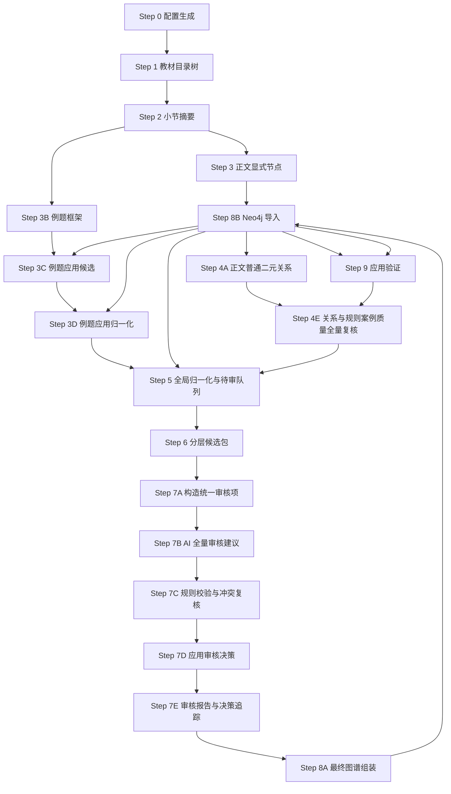
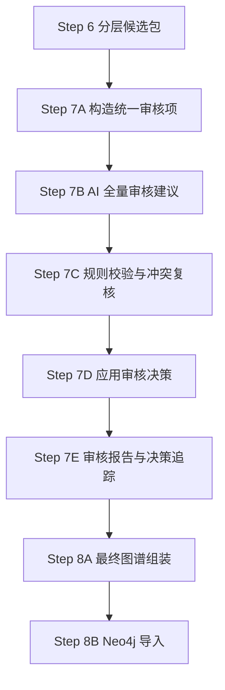

# v4.4 Step 说明

本文档用于说明 v4.4 工作区的真实执行流程。这里特意区分两个词：

- `step-text`：交流稿、方案文档、提示词中的解释性步骤，用来帮助人理解设计思想。
- `正式 Step`：本目录中可以运行的脚本步骤，以文件名前缀为准，例如 `03_extract_explicit_nodes.py`。

后续讨论“现在到 Step 几”时，以正式 Step 为准。

## 一、v4.4 的核心变化

v4.4 继承 v4.3 的主体流程：先构建教材目录树，再按小节生成摘要、节点、关系，最后归一化、审核、入库。v4.4 的新增重点是把“知识组”正式纳入最终图谱，解决节点过细后在 Neo4j 中呈现为大量散点的问题。

与 v4.2 的关键区别仍然保留：条件判断不再被压成一条普通边，也不再把“无解、唯一解、无穷多解”等状态轻易升级为核心概念。条件判断进入专门的规则案例层：

```text
核心定理/公式/方法
  --HAS_RULE_CASE-->
规则案例 RuleCase
  --APPLIES_TO-->
适用对象
  --HAS_CONDITION-->
条件表达式 ConditionExpression
  --HAS_OUTCOME-->
结论/状态 Outcome
```

示例：

```text
线性方程组解的判定定理 --HAS_RULE_CASE--> 无解判定
无解判定 --APPLIES_TO--> 非齐次线性方程组
无解判定 --HAS_CONDITION--> r(A)<r(A|b)
无解判定 --HAS_OUTCOME--> 线性方程组无解
```

这样做的原因是：条件判断本质上是“在某条件下得到某结论”的规则，不宜直接写成 `线性方程组 --某状态关系--> 无解`。直接连边虽然直观，但会丢掉条件，也容易让图谱误以为该状态无条件成立。

v4.4 进一步增加三项设计：

- 所有最终节点、边、规则案例保留 `source_code`，作为紧凑来源编码，例如 `gaodai_shang:C03:S05:U01`。教材来源是元数据，不默认建成可见的教材结构节点。
- Step 7 只负责审核与决策追踪，不生成 `KnowledgeGroup`，也不直接执行语义合并。
- Step 8A 根据 Step 7 的 approved 包和 `merge_plans.jsonl` 组装最终图谱，执行合并计划，并自动生成确定性 `KnowledgeGroup`，包括按小节生成的 `SectionGroup` 和按规则案例所属节点生成的 `RuleGroup`。这些组不由 LLM 自由发明。
- Step 8B 展开规则案例并导入 Neo4j。展开规则案例时，为条件表达式和结论节点生成保守的 `REFERS_TO` 边，使“系数矩阵的秩等于 n”这类条件能回连到 `系数矩阵`、`矩阵的秩` 等核心知识点。

## 二、正式 Step 总览



说明：当前代码已经新增独立的 Step 3E 节点质量全量复核、Step 4B 规则案例抽取入口和 Step 4E 关系质量全量复核入口。目标运行口径是：Step 3 只负责生成核心节点候选，Step 3E 全量复核节点质量；Step 3E 不把待审节点从后续候选发现中删除，而是标记哪些节点可直接进入主候选、哪些节点需 Step 7 复核。Step 4A/4B 只负责候选生成和预校验，Step 4E 负责全量复核普通边和规则案例质量；只有 Step 4E 判为 `review` 的边或规则案例才进入 Step 7。Step 5 仍兼容旧节点字段中的 `rule_cases`，但新流程不再要求 Step 3 生成规则案例。

## 三、当前 Step 7/8 准流程

当前 v4.4 采用“审核与组装分离”的流程。Step 7 只处理审核，不直接改最终图谱；Step 8A 才根据审核结果组装最终包。



### Step 7A：构造统一审核项

脚本：`07a_build_review_items.py`

读取 Step 6 的待审文件：

- `review_pending_nodes.jsonl`
- `review_pending_edges.jsonl`
- `review_pending_rule_cases.jsonl`
- `review_pending_merge_candidates.jsonl`

统一输出：

- `step7_review/review_items.jsonl`
- `step7_review/review_items_summary.md`

每个审核项包含 `review_item_id`、`item_kind`、`source_item`、`context`、`allowed_actions`、`default_action` 和 `risk_flags`。

### Step 7B：AI 全量审核建议

脚本：`07b_ai_review_suggestions.py`

读取 `review_items.jsonl`，用高智力模型给出全量审核建议。Step 7B 只是建议，不直接修改节点、边、规则案例或合并结果。

普通节点、边、规则案例允许动作：

```text
accept / reject / rewrite / defer
```

合并候选允许动作：

```text
accept_merge / reject_merge / defer
```

输出：

- `step7_review/ai_review_decisions.jsonl`
- `step7_review/ai_review_warnings.jsonl`
- `step7_review/ai_review_summary.md`

### Step 7C：规则校验与冲突复核

脚本：`07c_validate_review_decisions.py`

对 Step 7B 的建议做硬约束校验。硬约束不能被 AI 越过：

- 边端点不存在，不能 `accept edge`。
- 规则案例 owner 不存在，不能 `accept rule_case`。
- 合并节点类型不同，不能 `accept_merge`。
- 两个待合并节点已有上下位、部分整体、属性、使用、得到、推导等语义边时，不能 `accept_merge`。
- rewrite schema 不合法，不能接受 rewrite。

输出：

- `step7_review/validated_review_decisions.jsonl`
- `step7_review/conflict_review_items.jsonl`
- `step7_review/conflict_review_decisions.jsonl`
- `step7_review/decision_validation_errors.jsonl`
- `step7_review/decision_validation_summary.md`

当前实现中，冲突项先按保守策略处理：普通冲突转 `defer`，非法合并转 `reject_merge`。未来如果需要，可在 Step 7C 增加只针对冲突项的二次高智力 AI 复核，但硬约束仍保持最终约束力。

### Step 7D：应用审核决策

脚本：`07d_apply_review_decisions.py`

读取 `validated_review_decisions.jsonl`，把有效审核结果落盘为 Step 8A 的输入。

输出：

- `approved_nodes.jsonl`
- `approved_edges.jsonl`
- `approved_application_nodes.jsonl`
- `approved_application_edges.jsonl`
- `approved_rule_cases.jsonl`
- `merge_plans.jsonl`
- `review_archive.jsonl`
- `deferred_items.jsonl`
- `decision_trace.jsonl`

注意：`accept_merge` 不在 Step 7D 直接执行合并，只生成 `merge_plans.jsonl`。merge plan 记录主实体保留、别名合并、来源/evidence 合并、关系迁移、被合并节点标记等计划。

### Step 7E：审核报告与决策追踪

脚本：`07e_build_review_report.py`

汇总 Step 7A-7D 的审核产物，输出：

- `step7_review/review_report.md`

### Step 8A：最终图谱组装

脚本：`08a_assemble_final_graph.py`

读取 Step 7D 的 approved 包和 `merge_plans.jsonl`，真正执行合并计划：

- 保留 primary 节点。
- 将 secondary 的名称、别名、描述、来源证据并入 primary。
- 将指向 secondary 的边重定向到 primary。
- 将 RuleCase owner 从 secondary 改到 primary。
- 删除合并后产生的自环边和重复边。
- 生成 `SectionGroup` 和 `RuleGroup`。

输出：

- `step8a_final_package/final_core_nodes.jsonl`
- `step8a_final_package/final_core_edges.jsonl`
- `step8a_final_package/final_application_nodes.jsonl`
- `step8a_final_package/final_application_edges.jsonl`
- `step8a_final_package/final_rule_cases.jsonl`
- `step8a_final_package/final_knowledge_groups.jsonl`
- `step8a_final_package/final_knowledge_group_edges.jsonl`
- `step8a_final_package/final_archived_items.jsonl`
- `step8a_final_package/final_review_pending.jsonl`
- `step8a_final_package/merge_execution_trace.jsonl`
- `step8a_final_package/final_assembly_report.md`

### Step 8B：Neo4j 导入

脚本：`08_import_neo4j.py`

默认读取 `step8a_final_package`。核心节点/边、应用层节点/边和知识组直接导入；规则案例在导入时展开为规则层节点和边。

## 四、各正式 Step 的职责

### Step 0：配置生成

脚本：`00_prepare_config.py`

生成 `v4_4_gaoshu_config.json`，记录输入教材、输出目录、节点类型、边类型、LLM 配置和 Tree-KG API 适配信息。

当前清华 Tree-KG 公共接口在本地探测中返回过 403，因此 v4.3 把它作为“可选适配器”，默认仍走本地 DeepSeek 调用。

### Step 1：教材目录树

脚本：`01_build_textbook_tree.py`

读取结构化 Markdown，识别章、节、小节、锚点，区分内容精华、典型例题和习题。

习题默认不进入抽取；典型例题不进入正文核心节点抽取，但进入例题应用层。

对高数这类把 `##### 例1`、`##### 例2` 嵌入正文小节的教材，Step 1 会把例题锚点独立切成 `source_scope=example` 的叶子，并保留 `parent_section_node_id` 指向原正文小节。被例题分隔开的同一小节正文会重新合并成一个 `core_content` 叶子，避免例题混入核心节点抽取。

### Step 2：小节摘要

脚本：`02_generate_section_summaries.py`

按小节生成阅读导航，只包括：

- 小节梗概 `summary`
- 关键词 `key_terms`
- 小节角色说明 `section_role_notes`
- 习题跳过原因 `skip_reason`

Step 2 不生成定义片段、定理片段、公式片段、方法片段、条件判断提示或关系提示。它只帮助后续 LLM 理解当前小节主题，不直接提供候选节点和候选边。

### Step 3：正文显式节点

脚本：`03_extract_explicit_nodes.py`

从内容精华小节抽取核心节点候选：

- `Concept`
- `Method`
- `Formula`
- `Theorem`
- `ProblemClass`

定义不作为独立节点，写入相关节点的 `definition` 字段。

属性值不作为独立节点，默认进入 `attributes` 或 `state_notes`。目标流程中，条件判断、充要条件、判别准则或分情况结论不由 Step 3 处理，而由 Step 4B 规则案例环节处理。

Step 3 只产出候选节点文件 `nodes.jsonl`。脚本自身的 schema 校验 warning 只写入 `node_pre_audit_review_queue.jsonl`，这是预审提示，不等于最终 Step 7 review 队列。

兼容说明：当前脚本仍能处理旧 prompt 或旧产物中的 `rule_cases` 字段。由于这类嵌入节点字段的规则案例没有经过 Step 4E 全量复核，Step 5 会把它拆出并送入待审队列。新流程不再要求 Step 3 生成 `rule_cases`，条件规则应由 Step 4B 生成，并由 Step 4E 决定是否进入 Step 7。

### Step 3E：节点质量全量复核

脚本：`03e_audit_nodes.py`

对 Step 3 产出的全部节点做 AI 复核，输出：

- `nodes_audited.jsonl`：后续 Step 3C、Step 3D、Step 4A、Step 4B、Step 5 默认读取的节点文件。
- `node_review_queue.jsonl`：只有 Step 3E 判断有问题的节点才进入这里，并在 Step 7 中继续审核。
- `node_quality_audit_report.md`：复核统计报告。

复核只判断节点本身是否可作为正式知识点进入后续图谱构建，不重新抽取节点，不生成关系，也不审核规则案例的条件/结论。若节点本身成立，即使 Step 3 曾因 warning 标记为 review，Step 3E 也可以将其改为 `auto_accept`。

### Step 3B：例题框架

脚本：`03b_extract_example_frames.py`

只处理典型例题，输出 `ExampleFrame`，包括题型、方法、使用工具、得到结果等证据。

它不直接产正式 KG 节点和边。

### Step 3C：例题应用候选

脚本：`03c_convert_example_frames.py`

把 `ExampleFrame` 转成应用层候选：

- 例题中可复用的方法 `Method`
- 可复用题型 `ProblemClass`
- 应用关系 `USES` / `GETS`

这些候选默认需要审核，不直接进入核心主图。

Step 3C 会读取 `nodes_audited.jsonl` 作为正文核心节点池，包含 Step 3E 通过节点和待审节点。若例题中提到的方法或工具匹配到待审核心节点，相关应用层候选不会直接进主图，而是在 Step 5/7 中随端点节点一起复核。

### Step 3D：例题应用归一化

脚本：`03d_normalize_example_applications.py`

对例题应用候选做名称归一、核心节点匹配、重复合并。

推荐使用 `--clean-flow` 保留可疑候选进入 Step 5/7 审核，不在 Step 3D 提前删除或改写。

Step 3D 同样以完整的 `nodes_audited.jsonl` 为匹配对象。被 Step 3E 判为待审的正文节点可以参与候选匹配，但相关应用层边会带上待审端点 warning，进入 Step 7 复核，不直接进入主图。

### Step 4A：正文普通二元关系

脚本：`04_extract_explicit_edges.py`

在 `nodes_audited.jsonl` 的完整节点池内抽取普通显式二元关系：

- `SUPERIOR`：下位到上位
- `EQUATIVE`：同位、并列、同类
- `PART_OF`：部分到整体
- `HAS_PROPERTY`：对象到性质/准则/关于该对象的结论性命题
- `USES`：使用者到被使用工具
- `GETS`：方法/公式/定理得到结果
- `DERIVES`：推导依据到被推出结论

Step 4A 禁止输出条件判断关系，禁止输出 `HAS_CONDITION`、`HAS_OUTCOME`、`HAS_RULE_CASE`，也禁止旧关系名 `DERIVED_FROM`。

Step 4A 不做自动方向修正。若 `HAS_PROPERTY`、`SUPERIOR` 等方向可疑，应通过 prompt 约束 LLM 少输出或正确输出，而不是在脚本中自动翻转。

Step 4A 不进行语义补边，也不保留补边开关。若后续需要补充保守候选边，应另做 review-stage 补充候选脚本，并把补充结果交给审核环节，而不是混入普通关系抽取。

Step 4A 的脚本校验只产生预审 warning 和 `edge_pre_audit_review_queue.jsonl`，不作为最终 Step 7 review 依据。最终是否进入 Step 7，由 Step 4E 全量复核决定。可结构化解析的候选边即使带有硬性 schema warning，也会写入 `edges.jsonl` 交给 Step 4E；但硬性 schema warning 不允许被 AI 直接升级为 `auto_accept`。

端点缺失、关系类型非法、证据不在原文等硬性结构问题会被脚本标记为 `pre_audit_hard_warnings`；其余“方向可疑、证据偏弱、连接待审节点、LLM 建议复核”等情况，作为 Step 4E 的参考信息。

### Step 4B：条件判断与规则案例

脚本：`04b_extract_rule_cases.py`

Step 4B 专门处理条件判断、判别准则、充要条件和分情况结论。它不输出普通二元边，而是生成规则案例候选：

```text
RuleCase / Condition / Outcome / logic
```

典型输出结构：

```text
所属定理/公式/方法 --HAS_RULE_CASE--> RuleCase
RuleCase --APPLIES_TO--> 适用对象
RuleCase --HAS_CONDITION--> 条件表达式
RuleCase --HAS_OUTCOME--> 结论/状态
```

RuleCase 的 owner 优先选择 `Theorem`、`Formula`、`Method`。若原文是定义型条件、分类判定或“若……则称为……”类规则，且没有更合适的定理、公式或方法节点，可以挂载到 `Concept`。

示例：

```text
线性方程组解的判定定理 --HAS_RULE_CASE--> 无解判定
无解判定 --APPLIES_TO--> 非齐次线性方程组
无解判定 --HAS_CONDITION--> r(A)<r(A|b)
无解判定 --HAS_OUTCOME--> 线性方程组无解
```

Step 4B 的脚本校验只产生预审 warning 和 `rule_case_pre_audit_review_queue.jsonl`，不作为最终 Step 7 review 依据。最终是否进入 Step 7，由 Step 4E 全量复核决定。可结构化解析的规则案例即使带有硬性 schema warning，也会写入 `rule_cases.jsonl` 交给 Step 4E；但硬性 schema warning 不允许被 AI 直接升级为 `auto_accept`。

如果 RuleCase 挂载的 owner 节点被 Step 3E 判为待审，RuleCase 会携带 `rule_case_owner_review_node` warning，供 Step 4E 判断是否需要随 owner 节点一起复核。

### Step 4E：关系与规则案例质量全量复核

脚本：`04e_audit_relations.py`

对 Step 4A 产出的普通边和 Step 4B 产出的规则案例做 AI 全量复核，输出：

- `edges_audited.jsonl`：后续 Step 5 默认读取的普通边文件。
- `rule_cases_audited.jsonl`：后续 Step 5 默认读取的规则案例文件。
- `edge_review_queue.jsonl`：只有 Step 4E 判断有问题或需随待审节点一起复核的边才进入这里。
- `rule_case_review_queue.jsonl`：只有 Step 4E 判断有问题或需随 owner 节点一起复核的规则案例才进入这里。
- `relation_quality_audit_report.md`：复核统计报告。

复核只判断候选边和规则案例本身是否可以直接进入后续主候选流程，不重新抽取边，不补充规则案例，也不新增节点。若候选本身成立，即使 Step 4A/4B 曾因普通 warning 标记为 review，Step 4E 也可以将其改为 `auto_accept`。但若候选带有本地硬性 schema warning，Step 4E 即使收到 AI 的 `accept`，也会强制降为 `review`。

### Step 5：全局归一化与待审队列

脚本：`05_global_normalize_and_review.py`

读取 `nodes_audited.jsonl`、`edges_audited.jsonl`、`rule_cases_audited.jsonl` 与例题应用候选，合并成统一候选包，并分出：

- 自动进入主候选的核心节点/边
- 待审节点
- 待审普通边
- 待审规则案例
- 拒绝归档项

规则案例不再默认全部进入待审。Step 4E 判为 `auto_accept` 的规则案例进入规则案例主候选；Step 4E 判为 `review` 的规则案例进入 Step 7。

正文核心节点是否进入待审队列，只看 Step 3E 写入 `nodes_audited.jsonl` 的 `review_status`：`auto_accept` 进入主候选，`review` 进入 Step 7 待审。Step 3 的 `node_pre_audit_review_queue.jsonl` 只是预审提示，不直接进入 Step 7。

正文核心边是否进入待审队列，只看 Step 4E 写入 `edges_audited.jsonl` 的 `review_status`：`auto_accept` 进入主候选，`review` 进入 Step 7 待审。Step 4A 的 `edge_pre_audit_review_queue.jsonl` 只是预审提示，不直接进入 Step 7。

### Step 6：分层候选包

脚本：`06_build_layered_candidates.py`

把 Step 5 结果整理成阶段一分层包：

- `explicit_core`
- `example_application`
- `rule_case`
- `review_pending`
- `rejected_archive`

这一层仍不做最终人工决策，也不写 Neo4j。

### Step 7A：审核决策草稿

脚本：`07_prepare_review_preapproval.py`

读取 Step 6 待审项，生成结构化决策草稿：

- 节点决策
- 普通边决策
- 条件判断规则案例决策

默认策略是保守暂缓：未明确接受的项目不会进入最终包。

可用决策：

- `accept`：接受进入最终包
- `rewrite`：改写后进入最终包，原件进归档
- `reject`：拒绝，原件进归档
- `defer`：暂缓，进入最终待审文件

### Step 7B：应用审核决策

脚本：`07b_apply_review_decisions.py`

把 Step 7A 的决策真正落盘，生成：

- `final_core_nodes.jsonl`
- `final_core_edges.jsonl`
- `final_application_nodes.jsonl`
- `final_application_edges.jsonl`
- `final_rule_cases.jsonl`
- `final_knowledge_groups.jsonl`
- `final_knowledge_group_edges.jsonl`
- `final_archived_items.jsonl`
- `final_review_pending.jsonl`
- `decision_trace.jsonl`

注意：节点里的 `rule_cases` 字段在 Step 7B 会清空。只有 `final_rule_cases.jsonl` 中通过审核的规则案例，Step 8 才会展开入库。这样可以避免“规则案例被拒绝，但仍藏在节点字段里导入”的问题。

v4.4 对普通边增加两条落盘守卫：

- 接受或改写后的边，必须保证源节点和目标节点都已经进入最终节点包；否则该边进入 `final_review_pending.jsonl`，不会写入最终边文件。
- 普通边按“源端点 + 目标端点 + 关系类型 + 图层”的语义键去重，而不是按候选阶段的 `edge_id` 去重。这样同一条数学关系即使来自 LLM 候选或审核改写，也不会重复导入。

v4.4 在 Step 7B 额外自动生成知识组：

- `SectionGroup`：按 `section_node_id` 自动生成，一个小节一个组。该组通过 `HAS_MEMBER` 指向本小节通过审核的核心知识点。
- `RuleGroup`：按规则案例的 `owner_node_id` 自动生成，一个拥有规则案例的定理、公式或方法对应一个规则组。该组通过 `HAS_ANCHOR` 指向所属核心节点，并通过 `HAS_MEMBER` 指向它的规则案例。
- `TopicGroup`、`MethodGroup` 暂不自动生成。未来如果需要主题组或方法组，应由 LLM 提议、进入审核队列，再由人工或高智力审核脚本确认。

### Step 8：Neo4j 导入

脚本：`08_import_neo4j.py`

读取 Step 7B 最终包。核心节点/边和应用层节点/边直接导入；规则案例先展开为规则层节点和边，再导入 Neo4j。

v4.4 同时导入 `KnowledgeGroup` 与知识组关系。知识组关系是导航关系，不等同于数学语义关系。

规则案例展开时会生成：

- `RuleCase`
- `ConditionExpression`
- `Outcome`
- `HAS_RULE_CASE`
- `APPLIES_TO`
- `HAS_CONDITION` / `HAS_CONDITION_AND`
- `HAS_OUTCOME`
- `REFERS_TO`

其中 `REFERS_TO` 用于表达“条件表达式或结论文本中提到了某个核心知识点”。例如：

```text
有解判定 --HAS_CONDITION--> 系数矩阵与增广矩阵的秩相等
系数矩阵与增广矩阵的秩相等 --REFERS_TO--> 系数矩阵
系数矩阵与增广矩阵的秩相等 --REFERS_TO--> 增广矩阵
系数矩阵与增广矩阵的秩相等 --REFERS_TO--> 矩阵的秩
```

如果规则案例缺少所属节点、条件、结论或证据，Step 8 会产生 warning。执行导入时若存在 warning，会拒绝入库。

### Step 9：应用验证

脚本：`09_application_validation.py`

连接 Step 8 已导入的 Neo4j 图谱，使用一组面向智学助手真实场景的验收问题进行验证。当前默认测试覆盖：

- 核心知识点是否能查到；
- 学生不会某知识点时，是否能找到相关支撑知识；
- 给定知识点时，是否能推荐相关方法、公式或性质；
- 两个知识点之间是否存在可解释路径；
- 条件判断类问题是否能从规则案例层返回适用对象、条件、结论和证据。

Step 9 只读 Neo4j，不修改图谱。它的产物是应用验证报告和原始查询结果，用来判断当前图谱是否能服务学习路径、知识追溯、方法推荐和条件判断问答。如果测试失败或只部分通过，应回到抽取规则、关系定义、审核策略或导入展开逻辑中修正，而不是在 Step 9 直接补边。

v4.4 的 Step 9 必须同时报告两个口径：

- 结构孤立节点：把所有边都算进去，包括 `HAS_MEMBER`、`HAS_ANCHOR`。
- 语义孤立节点：忽略知识组边，只看数学语义关系和规则层关系。

原因是知识组会让图谱在结构上更连通，但不能替代核心数学语义边。应用验证时必须区分“便于导航”和“语义关系充分”。

## 四、关系类型分层

### 教材结构层

```text
HAS_SUBSECTION
INTRODUCES
HAS_EXAMPLE
```

### 核心普通关系层

```text
SUPERIOR
EQUATIVE
PART_OF
HAS_PROPERTY
USES
GETS
DERIVES
```

### 条件判断规则层

```text
HAS_RULE_CASE
APPLIES_TO
HAS_CONDITION
HAS_CONDITION_AND
HAS_CONDITION_OR
HAS_OUTCOME
HAS_OUTCOME_AND
HAS_OUTCOME_OR
REFERS_TO
```

### 知识组导航层

```text
HAS_MEMBER
HAS_ANCHOR
RELATES_TO_GROUP
```

当前已实现 `HAS_MEMBER` 和 `HAS_ANCHOR`。`RELATES_TO_GROUP` 是预留关系，用于未来表达核心节点与主题组、方法组之间的导航连接。

### 派生/展示层

```text
PREREQUISITE_OF
HAS_POSSIBLE_STATE
```

这两类不由 Step 4 直接抽取，可在后续应用验证或图查询展示中从核心图与规则层推导。

## 五、条件判断的处理口径

遇到下列表达时，优先进入规则案例层：

- 若 A，则 B
- 当 A 时，B
- A 当且仅当 B
- A 的充要条件是 B
- 分情况讨论，每种情况有明确结论

不推荐：

```text
线性方程组 --状态关系--> 无解
条件表达式 --DERIVES--> 无解
线性方程组 --GETS--> 无解
```

推荐：

```text
判定定理 --HAS_RULE_CASE--> 无解判定
无解判定 --APPLIES_TO--> 线性方程组
无解判定 --HAS_CONDITION--> 秩条件
无解判定 --HAS_OUTCOME--> 无解
```

如果应用端需要快速查询“线性方程组可能有哪些状态”，可以在展示层派生：

```text
线性方程组 --HAS_POSSIBLE_STATE--> 无解
```

但这条边必须标明是派生/展示边，不替代规则层的条件结构。

## 六、知识组的处理口径

知识组的目标不是替代概念、定理、公式、方法之间的数学关系，而是提供一个中间层，让应用端可以把同一小节、同一规则主题或同一方法族中的细粒度节点组织起来。

当前实现只允许两类确定性知识组：

- `SectionGroup`：由教材小节自动生成，组名采用小节名，来源编码来自 `section_node_id`。
- `RuleGroup`：由已通过审核的规则案例自动生成，组名采用“所属知识点 + 规则组”。

暂不允许 LLM 直接生成自由知识组，原因是自由主题组容易把“教材位置相近”“概念语义相近”“解题方法相近”混在一起，导致组边含义不清。后续如果引入 `TopicGroup` 或 `MethodGroup`，必须进入审核环节，并明确组的创建依据。

## 七、来源编码原则

`source_code` 是紧凑来源字段，不是默认图谱节点。建议格式：

```text
教材ID:章:节:小节
教材ID:章:节:小节:段
教材ID:章:节:小节:句
```

当前脚本主要使用到小节级，例如：

```text
gaodai_shang:C03:S05:U01
```

这样做的好处是：Neo4j 中的知识图谱仍以数学知识为主，不被教材目录节点淹没；但每个节点和边仍能追溯到教材来源。

## 八、审核产物原则

v4.4 明确要求：被拒绝、改写或暂缓的内容不能无痕消失。

- 拒绝项进入 `final_archived_items.jsonl`
- 暂缓项进入 `final_review_pending.jsonl`
- 改写项保留原件，并把改写结果写入最终包
- 所有动作进入 `decision_trace.jsonl`

这保证后续可以追溯：某个候选为什么没进图，是被拒绝、被改写，还是仍待审。
